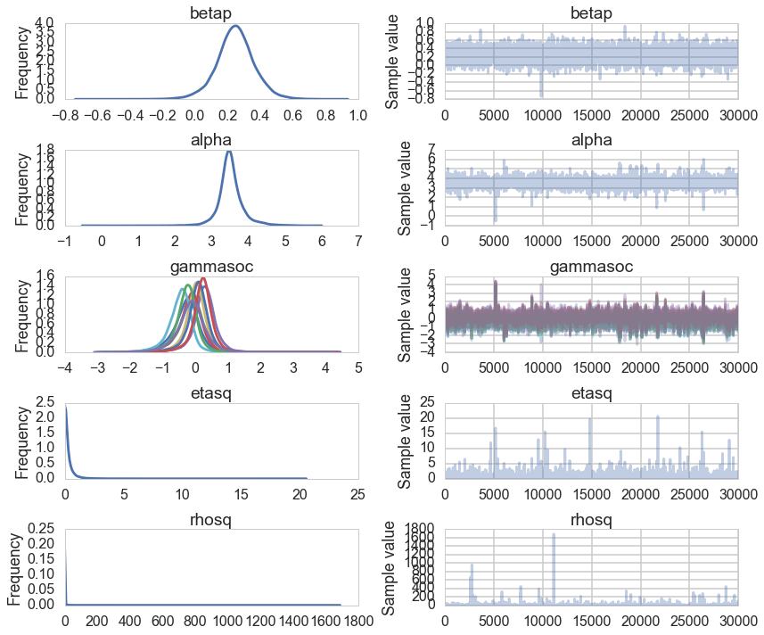
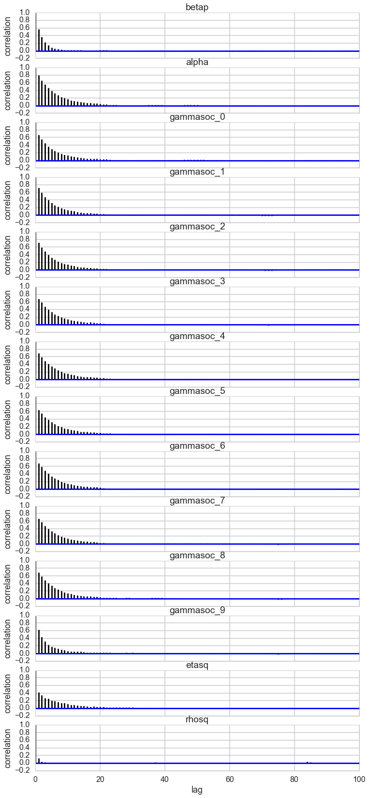
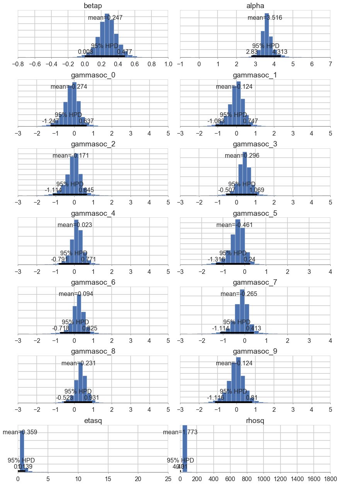
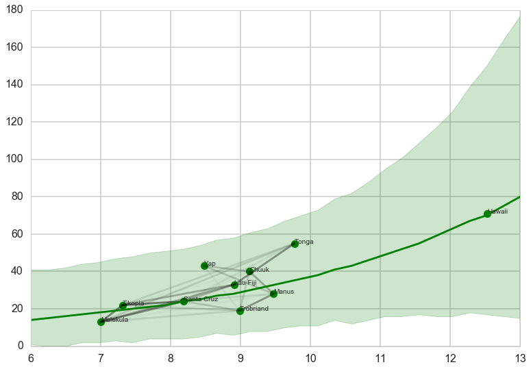




```python
%matplotlib inline
import numpy as np
import scipy as sp
import matplotlib as mpl
import matplotlib.cm as cm
import matplotlib.pyplot as plt
import pandas as pd
pd.set_option('display.width', 500)
pd.set_option('display.max_columns', 100)
pd.set_option('display.notebook_repr_html', True)
import seaborn as sns
sns.set_style("whitegrid")
sns.set_context("poster")
import pymc3 as pm
```


## Reading in our data

We read back the Oceanic tools data


```python
df = pd.read_csv("data/Kline2.csv", sep=';')
df.head()
```


<div>
<table border="1" class="dataframe">
  <thead>
    <tr style="text-align: right;">
      <th></th>
      <th>culture</th>
      <th>population</th>
      <th>contact</th>
      <th>total_tools</th>
      <th>mean_TU</th>
      <th>lat</th>
      <th>lon</th>
      <th>lon2</th>
      <th>logpop</th>
    </tr>
  </thead>
  <tbody>
    <tr>
      <th>0</th>
      <td>Malekula</td>
      <td>1100</td>
      <td>low</td>
      <td>13</td>
      <td>3.2</td>
      <td>-16.3</td>
      <td>167.5</td>
      <td>-12.5</td>
      <td>7.003065</td>
    </tr>
    <tr>
      <th>1</th>
      <td>Tikopia</td>
      <td>1500</td>
      <td>low</td>
      <td>22</td>
      <td>4.7</td>
      <td>-12.3</td>
      <td>168.8</td>
      <td>-11.2</td>
      <td>7.313220</td>
    </tr>
    <tr>
      <th>2</th>
      <td>Santa Cruz</td>
      <td>3600</td>
      <td>low</td>
      <td>24</td>
      <td>4.0</td>
      <td>-10.7</td>
      <td>166.0</td>
      <td>-14.0</td>
      <td>8.188689</td>
    </tr>
    <tr>
      <th>3</th>
      <td>Yap</td>
      <td>4791</td>
      <td>high</td>
      <td>43</td>
      <td>5.0</td>
      <td>9.5</td>
      <td>138.1</td>
      <td>-41.9</td>
      <td>8.474494</td>
    </tr>
    <tr>
      <th>4</th>
      <td>Lau Fiji</td>
      <td>7400</td>
      <td>high</td>
      <td>33</td>
      <td>5.0</td>
      <td>-17.7</td>
      <td>178.1</td>
      <td>-1.9</td>
      <td>8.909235</td>
    </tr>
  </tbody>
</table>
</div>


And center it


```python
df['logpop_c'] = df.logpop - df.logpop.mean()
```


```python
df.head()
```


<div>
<table border="1" class="dataframe">
  <thead>
    <tr style="text-align: right;">
      <th></th>
      <th>culture</th>
      <th>population</th>
      <th>contact</th>
      <th>total_tools</th>
      <th>mean_TU</th>
      <th>lat</th>
      <th>lon</th>
      <th>lon2</th>
      <th>logpop</th>
      <th>logpop_c</th>
    </tr>
  </thead>
  <tbody>
    <tr>
      <th>0</th>
      <td>Malekula</td>
      <td>1100</td>
      <td>low</td>
      <td>13</td>
      <td>3.2</td>
      <td>-16.3</td>
      <td>167.5</td>
      <td>-12.5</td>
      <td>7.003065</td>
      <td>-1.973939</td>
    </tr>
    <tr>
      <th>1</th>
      <td>Tikopia</td>
      <td>1500</td>
      <td>low</td>
      <td>22</td>
      <td>4.7</td>
      <td>-12.3</td>
      <td>168.8</td>
      <td>-11.2</td>
      <td>7.313220</td>
      <td>-1.663784</td>
    </tr>
    <tr>
      <th>2</th>
      <td>Santa Cruz</td>
      <td>3600</td>
      <td>low</td>
      <td>24</td>
      <td>4.0</td>
      <td>-10.7</td>
      <td>166.0</td>
      <td>-14.0</td>
      <td>8.188689</td>
      <td>-0.788316</td>
    </tr>
    <tr>
      <th>3</th>
      <td>Yap</td>
      <td>4791</td>
      <td>high</td>
      <td>43</td>
      <td>5.0</td>
      <td>9.5</td>
      <td>138.1</td>
      <td>-41.9</td>
      <td>8.474494</td>
      <td>-0.502510</td>
    </tr>
    <tr>
      <th>4</th>
      <td>Lau Fiji</td>
      <td>7400</td>
      <td>high</td>
      <td>33</td>
      <td>5.0</td>
      <td>-17.7</td>
      <td>178.1</td>
      <td>-1.9</td>
      <td>8.909235</td>
      <td>-0.067769</td>
    </tr>
  </tbody>
</table>
</div>


And read in the distance matrix


```python
dfd = pd.read_csv("data/mymatrix.txt", header=None)
dij=dfd.values
dij
```


    array([[ 0.   ,  0.475,  0.631,  4.363,  1.234,  2.036,  3.178,  2.794,
             1.86 ,  5.678],
           [ 0.475,  0.   ,  0.315,  4.173,  1.236,  2.007,  2.877,  2.67 ,
             1.965,  5.283],
           [ 0.631,  0.315,  0.   ,  3.859,  1.55 ,  1.708,  2.588,  2.356,
             2.279,  5.401],
           [ 4.363,  4.173,  3.859,  0.   ,  5.391,  2.462,  1.555,  1.616,
             6.136,  7.178],
           [ 1.234,  1.236,  1.55 ,  5.391,  0.   ,  3.219,  4.027,  3.906,
             0.763,  4.884],
           [ 2.036,  2.007,  1.708,  2.462,  3.219,  0.   ,  1.801,  0.85 ,
             3.893,  6.653],
           [ 3.178,  2.877,  2.588,  1.555,  4.027,  1.801,  0.   ,  1.213,
             4.789,  5.787],
           [ 2.794,  2.67 ,  2.356,  1.616,  3.906,  0.85 ,  1.213,  0.   ,
             4.622,  6.722],
           [ 1.86 ,  1.965,  2.279,  6.136,  0.763,  3.893,  4.789,  4.622,
             0.   ,  5.037],
           [ 5.678,  5.283,  5.401,  7.178,  4.884,  6.653,  5.787,  6.722,
             5.037,  0.   ]])


## Implementing the simple tools:logpop model and varying intercepts models


```python
import theano.tensor as tt
```


```python
import theano.tensor as t
with pm.Model() as m2c_onlyp:
    betap = pm.Normal("betap", 0, 1)
    alpha = pm.Normal("alpha", 0, 100)
    loglam = alpha + betap*df.logpop_c
    y = pm.Poisson("ntools", mu=t.exp(loglam), observed=df.total_tools)
    trace2c_onlyp = pm.sample(5000, njobs=2)
```


    Average ELBO = -50.136: 100%|██████████| 200000/200000 [00:13<00:00, 15198.50it/s]4, 14098.60it/s]
    100%|██████████| 5000/5000 [00:06<00:00, 816.44it/s]


```python
pm.summary(trace2c_onlyp)
```


    
    betap:
    
      Mean             SD               MC Error         95% HPD interval
      -------------------------------------------------------------------
      
      0.239            0.031            0.000            [0.180, 0.302]
    
      Posterior quantiles:
      2.5            25             50             75             97.5
      |--------------|==============|==============|--------------|
      
      0.177          0.218          0.239          0.259          0.299
    
    
    alpha:
    
      Mean             SD               MC Error         95% HPD interval
      -------------------------------------------------------------------
      
      3.478            0.056            0.001            [3.372, 3.593]
    
      Posterior quantiles:
      2.5            25             50             75             97.5
      |--------------|==============|==============|--------------|
      
      3.365          3.442          3.479          3.516          3.588
    


Notice that $\beta_P$ has a value around 0.24

We also implement the varying intercepts per society model from before


```python
with pm.Model() as m3c:
    betap = pm.Normal("betap", 0, 1)
    alpha = pm.Normal("alpha", 0, 100)
    sigmasoc = pm.HalfCauchy("sigmasoc", 1)
    alphasoc = pm.Normal("alphasoc", 0, sigmasoc, shape=df.shape[0])
    loglam = alpha + alphasoc + betap*df.logpop_c 
    y = pm.Poisson("ntools", mu=t.exp(loglam), observed=df.total_tools)
with m3c:
    trace3 = pm.sample(5000, njobs=2)
```


    Average ELBO = -49.848: 100%|██████████| 200000/200000 [00:18<00:00, 11100.71it/s], 8854.94it/s]
    100%|██████████| 5000/5000 [00:21<00:00, 228.07it/s]


```python
pm.summary(trace3)
```


    
    betap:
    
      Mean             SD               MC Error         95% HPD interval
      -------------------------------------------------------------------
      
      0.259            0.079            0.001            [0.100, 0.417]
    
      Posterior quantiles:
      2.5            25             50             75             97.5
      |--------------|==============|==============|--------------|
      
      0.104          0.209          0.257          0.305          0.423
    
    
    alpha:
    
      Mean             SD               MC Error         95% HPD interval
      -------------------------------------------------------------------
      
      3.443            0.121            0.002            [3.201, 3.683]
    
      Posterior quantiles:
      2.5            25             50             75             97.5
      |--------------|==============|==============|--------------|
      
      3.185          3.372          3.447          3.519          3.672
    
    
    alphasoc:
    
      Mean             SD               MC Error         95% HPD interval
      -------------------------------------------------------------------
      
      -0.208           0.241            0.003            [-0.713, 0.244]
      0.040            0.216            0.003            [-0.387, 0.473]
      -0.046           0.193            0.002            [-0.440, 0.322]
      0.326            0.187            0.003            [-0.008, 0.716]
      0.044            0.178            0.002            [-0.294, 0.408]
      -0.318           0.209            0.002            [-0.737, 0.073]
      0.148            0.172            0.002            [-0.193, 0.483]
      -0.170           0.183            0.002            [-0.533, 0.176]
      0.278            0.175            0.002            [-0.041, 0.641]
      -0.086           0.285            0.004            [-0.677, 0.471]
    
      Posterior quantiles:
      2.5            25             50             75             97.5
      |--------------|==============|==============|--------------|
      
      -0.735         -0.351         -0.191         -0.049         0.227
      -0.376         -0.095         0.036          0.172          0.487
      -0.434         -0.169         -0.045         0.079          0.330
      -0.005         0.194          0.319          0.446          0.722
      -0.303         -0.068         0.040          0.153          0.401
      -0.764         -0.450         -0.303         -0.174         0.053
      -0.184         0.036          0.143          0.258          0.497
      -0.543         -0.287         -0.163         -0.047         0.169
      -0.035         0.159          0.268          0.387          0.649
      -0.666         -0.250         -0.079         0.079          0.487
    
    
    sigmasoc:
    
      Mean             SD               MC Error         95% HPD interval
      -------------------------------------------------------------------
      
      0.309            0.127            0.002            [0.098, 0.569]
    
      Posterior quantiles:
      2.5            25             50             75             97.5
      |--------------|==============|==============|--------------|
      
      0.120          0.222          0.289          0.373          0.621
    


## A model with a custom covariance matrix

We use a custom covariance matrix which inverse-square weights distance


This is an example of a Gaussian Process Covariance Matrix. We'll learn more about this in lecture.

Here is the complete model:


```python
with pm.Model() as mgc:
    betap = pm.Normal("betap", 0, 1)
    alpha = pm.Normal("alpha", 0, 10)
    etasq = pm.HalfCauchy("etasq", 1)
    rhosq = pm.HalfCauchy("rhosq", 1)
    means=tt.stack([0.0]*10)
    sigma_matrix = tt.nlinalg.diag([0.01]*10)
    cov=tt.exp(-rhosq*dij*dij)*etasq + sigma_matrix
    gammasoc = pm.MvNormal("gammasoc", means, cov=cov, shape=df.shape[0])
    loglam = alpha + gammasoc + betap*df.logpop_c 
    y = pm.Poisson("ntools", mu=t.exp(loglam), observed=df.total_tools)
```


```python
with mgc:
    mgctrace = pm.sample(30000)
```


    Average ELBO = -52.888: 100%|██████████| 200000/200000 [01:03<00:00, 3162.17it/s]1, 2784.29it/s]
    100%|██████████| 30000/30000 [04:14<00:00, 117.68it/s]


```python
pm.traceplot(mgctrace);
```





```python
pm.autocorrplot(mgctrace);
```





```python
pm.plot_posterior(mgctrace);
```





```python
d={}
for i, v in enumerate(df.culture.values):
    d[v] = mgctrace['gammasoc'][:,i]
dfsamps=pd.DataFrame.from_dict(d)
dfsamps.head()
```


<div>
<table border="1" class="dataframe">
  <thead>
    <tr style="text-align: right;">
      <th></th>
      <th>Chuuk</th>
      <th>Hawaii</th>
      <th>Lau Fiji</th>
      <th>Malekula</th>
      <th>Manus</th>
      <th>Santa Cruz</th>
      <th>Tikopia</th>
      <th>Tonga</th>
      <th>Trobriand</th>
      <th>Yap</th>
    </tr>
  </thead>
  <tbody>
    <tr>
      <th>0</th>
      <td>0.836138</td>
      <td>0.304428</td>
      <td>0.820912</td>
      <td>0.816184</td>
      <td>0.536671</td>
      <td>0.590162</td>
      <td>0.559185</td>
      <td>0.893075</td>
      <td>0.024161</td>
      <td>1.243371</td>
    </tr>
    <tr>
      <th>1</th>
      <td>0.836138</td>
      <td>0.304428</td>
      <td>0.820912</td>
      <td>0.816184</td>
      <td>0.536671</td>
      <td>0.590162</td>
      <td>0.559185</td>
      <td>0.893075</td>
      <td>0.024161</td>
      <td>1.243371</td>
    </tr>
    <tr>
      <th>2</th>
      <td>0.703682</td>
      <td>0.504951</td>
      <td>0.730426</td>
      <td>0.540004</td>
      <td>0.519810</td>
      <td>0.663994</td>
      <td>0.681683</td>
      <td>0.971137</td>
      <td>-0.008614</td>
      <td>1.205802</td>
    </tr>
    <tr>
      <th>3</th>
      <td>0.567167</td>
      <td>0.534332</td>
      <td>0.916450</td>
      <td>0.164368</td>
      <td>0.444714</td>
      <td>0.804241</td>
      <td>0.773782</td>
      <td>0.883073</td>
      <td>0.289772</td>
      <td>1.032754</td>
    </tr>
    <tr>
      <th>4</th>
      <td>-0.683220</td>
      <td>-0.089243</td>
      <td>-0.643991</td>
      <td>-1.336777</td>
      <td>-0.979924</td>
      <td>-0.969825</td>
      <td>-1.143890</td>
      <td>-0.470816</td>
      <td>-1.322837</td>
      <td>-0.346867</td>
    </tr>
  </tbody>
</table>
</div>


```python
dfsamps.describe()
```


<div>
<table border="1" class="dataframe">
  <thead>
    <tr style="text-align: right;">
      <th></th>
      <th>Chuuk</th>
      <th>Hawaii</th>
      <th>Lau Fiji</th>
      <th>Malekula</th>
      <th>Manus</th>
      <th>Santa Cruz</th>
      <th>Tikopia</th>
      <th>Tonga</th>
      <th>Trobriand</th>
      <th>Yap</th>
    </tr>
  </thead>
  <tbody>
    <tr>
      <th>count</th>
      <td>30000.000000</td>
      <td>30000.000000</td>
      <td>30000.000000</td>
      <td>30000.000000</td>
      <td>30000.000000</td>
      <td>30000.000000</td>
      <td>30000.000000</td>
      <td>30000.000000</td>
      <td>30000.000000</td>
      <td>30000.000000</td>
    </tr>
    <tr>
      <th>mean</th>
      <td>0.094261</td>
      <td>-0.124028</td>
      <td>0.023465</td>
      <td>-0.273515</td>
      <td>-0.265189</td>
      <td>-0.170598</td>
      <td>-0.124225</td>
      <td>0.231100</td>
      <td>-0.460621</td>
      <td>0.295641</td>
    </tr>
    <tr>
      <th>std</th>
      <td>0.385037</td>
      <td>0.480892</td>
      <td>0.388604</td>
      <td>0.462563</td>
      <td>0.387340</td>
      <td>0.436725</td>
      <td>0.450476</td>
      <td>0.369004</td>
      <td>0.397420</td>
      <td>0.393198</td>
    </tr>
    <tr>
      <th>min</th>
      <td>-2.529666</td>
      <td>-3.093213</td>
      <td>-2.614361</td>
      <td>-2.995777</td>
      <td>-2.774822</td>
      <td>-2.871235</td>
      <td>-2.798763</td>
      <td>-2.348071</td>
      <td>-3.021011</td>
      <td>-2.247205</td>
    </tr>
    <tr>
      <th>25%</th>
      <td>-0.083272</td>
      <td>-0.379004</td>
      <td>-0.158029</td>
      <td>-0.503521</td>
      <td>-0.444747</td>
      <td>-0.376714</td>
      <td>-0.343255</td>
      <td>0.065343</td>
      <td>-0.651914</td>
      <td>0.110146</td>
    </tr>
    <tr>
      <th>50%</th>
      <td>0.104171</td>
      <td>-0.119327</td>
      <td>0.035521</td>
      <td>-0.242750</td>
      <td>-0.243438</td>
      <td>-0.139088</td>
      <td>-0.100060</td>
      <td>0.240586</td>
      <td>-0.426263</td>
      <td>0.302898</td>
    </tr>
    <tr>
      <th>75%</th>
      <td>0.285664</td>
      <td>0.128399</td>
      <td>0.215014</td>
      <td>-0.017278</td>
      <td>-0.063474</td>
      <td>0.067777</td>
      <td>0.121864</td>
      <td>0.408959</td>
      <td>-0.237074</td>
      <td>0.495714</td>
    </tr>
    <tr>
      <th>max</th>
      <td>4.446998</td>
      <td>4.257859</td>
      <td>4.204263</td>
      <td>3.921945</td>
      <td>3.886337</td>
      <td>3.996297</td>
      <td>3.905850</td>
      <td>4.363513</td>
      <td>3.742380</td>
      <td>4.457200</td>
    </tr>
  </tbody>
</table>
</div>


```python
pm.summary(mgctrace)
```


    
    betap:
    
      Mean             SD               MC Error         95% HPD interval
      -------------------------------------------------------------------
      
      0.247            0.117            0.001            [0.008, 0.477]
    
      Posterior quantiles:
      2.5            25             50             75             97.5
      |--------------|==============|==============|--------------|
      
      0.009          0.178          0.247          0.317          0.478
    
    
    alpha:
    
      Mean             SD               MC Error         95% HPD interval
      -------------------------------------------------------------------
      
      3.516            0.365            0.006            [2.830, 4.313]
    
      Posterior quantiles:
      2.5            25             50             75             97.5
      |--------------|==============|==============|--------------|
      
      2.859          3.350          3.494          3.661          4.348
    
    
    gammasoc:
    
      Mean             SD               MC Error         95% HPD interval
      -------------------------------------------------------------------
      
      -0.274           0.463            0.007            [-1.247, 0.637]
      -0.124           0.450            0.007            [-1.083, 0.747]
      -0.171           0.437            0.007            [-1.114, 0.645]
      0.296            0.393            0.006            [-0.507, 1.069]
      0.023            0.389            0.007            [-0.791, 0.771]
      -0.461           0.397            0.007            [-1.316, 0.240]
      0.094            0.385            0.006            [-0.718, 0.825]
      -0.265           0.387            0.006            [-1.114, 0.413]
      0.231            0.369            0.006            [-0.523, 0.931]
      -0.124           0.481            0.007            [-1.116, 0.810]
    
      Posterior quantiles:
      2.5            25             50             75             97.5
      |--------------|==============|==============|--------------|
      
      -1.307         -0.504         -0.243         -0.017         0.587
      -1.126         -0.343         -0.100         0.122          0.714
      -1.162         -0.377         -0.139         0.068          0.612
      -0.563         0.110          0.303          0.496          1.023
      -0.824         -0.158         0.036          0.215          0.746
      -1.350         -0.652         -0.426         -0.237         0.214
      -0.747         -0.083         0.104          0.286          0.803
      -1.112         -0.445         -0.243         -0.063         0.418
      -0.561         0.065          0.241          0.409          0.901
      -1.116         -0.379         -0.119         0.128          0.810
    
    
    etasq:
    
      Mean             SD               MC Error         95% HPD interval
      -------------------------------------------------------------------
      
      0.359            0.589            0.010            [0.000, 1.139]
    
      Posterior quantiles:
      2.5            25             50             75             97.5
      |--------------|==============|==============|--------------|
      
      0.026          0.104          0.201          0.402          1.621
    
    
    rhosq:
    
      Mean             SD               MC Error         95% HPD interval
      -------------------------------------------------------------------
      
      1.773            15.388           0.115            [0.000, 4.431]
    
      Posterior quantiles:
      2.5            25             50             75             97.5
      |--------------|==============|==============|--------------|
      
      0.033          0.154          0.394          0.975          8.569
    


## Plotting posteriors and predictives

Lets plot the covariance posteriors.


```python
smalleta=np.random.choice(mgctrace['etasq'], replace=False, size=100)
smallrho=np.random.choice(mgctrace['rhosq'], replace=False, size=100)
d=np.linspace(0,10,100)
for i in range(100):
    covarod = lambda d: smalleta[i]*np.exp(-smallrho[i]*d*d)
    plt.plot(d, covarod(d),alpha=0.1, color='k')
medetasq=np.median(mgctrace['etasq'])
medrhosq=np.median(mgctrace['rhosq'])
covarodmed = lambda d: medetasq*np.exp(-medrhosq*d*d)
plt.plot(d, covarodmed(d),alpha=1.0, color='k', lw=3)
plt.ylim([0,1]); 
```


The x-axis is thousands of kilometers. Notice how almost everything damps out by 4000 kms. Lets calculate the median correlation matrix:


```python
medkij = np.diag([0.01]*10)+medetasq*(np.exp(-medrhosq*dij*dij))
```


```python
#from statsmodels
def cov2corr(cov, return_std=False):
    '''convert covariance matrix to correlation matrix

    Parameters
    ----------
    cov : array_like, 2d
        covariance matrix, see Notes

    Returns
    -------
    corr : ndarray (subclass)
        correlation matrix
    return_std : bool
        If this is true then the standard deviation is also returned.
        By default only the correlation matrix is returned.

    Notes
    -----
    This function does not convert subclasses of ndarrays. This requires
    that division is defined elementwise. np.ma.array and np.matrix are allowed.

    '''
    cov = np.asanyarray(cov)
    std_ = np.sqrt(np.diag(cov))
    corr = cov / np.outer(std_, std_)
    if return_std:
        return corr, std_
    else:
        return corr
```


```python
medcorrij=cov2corr(medkij)
medcorrij
```


    array([[  1.00000000e+00,   8.71753319e-01,   8.14523188e-01,
              5.31288769e-04,   5.23221633e-01,   1.86395976e-01,
              1.78937777e-02,   4.41233043e-02,   2.44138854e-01,
              2.94099446e-06],
           [  8.71753319e-01,   1.00000000e+00,   9.16216525e-01,
              1.00586197e-03,   5.22205376e-01,   1.95198554e-01,
              3.66620167e-02,   5.76067901e-02,   2.08444504e-01,
              1.61627858e-05],
           [  8.14523188e-01,   9.16216525e-01,   1.00000000e+00,
              2.71400897e-03,   3.70099328e-01,   3.02227464e-01,
              6.82602100e-02,   1.07205298e-01,   1.23372218e-01,
              9.84086103e-06],
           [  5.31288769e-04,   1.00586197e-03,   2.71400897e-03,
              1.00000000e+00,   1.02678372e-05,   8.76849660e-02,
              3.67844898e-01,   3.40881293e-01,   3.49678298e-07,
              1.48743820e-09],
           [  5.23221633e-01,   5.22205376e-01,   3.70099328e-01,
              1.02678372e-05,   1.00000000e+00,   1.61388725e-02,
              1.61126110e-03,   2.35089118e-03,   7.57621831e-01,
              7.97779882e-05],
           [  1.86395976e-01,   1.95198554e-01,   3.02227464e-01,
              8.76849660e-02,   1.61388725e-02,   1.00000000e+00,
              2.65800523e-01,   7.16913665e-01,   2.44659324e-03,
              2.59148592e-08],
           [  1.78937777e-02,   3.66620167e-02,   6.82602100e-02,
              3.67844898e-01,   1.61126110e-03,   2.65800523e-01,
              1.00000000e+00,   5.33910976e-01,   1.14537862e-04,
              1.79843954e-06],
           [  4.41233043e-02,   5.76067901e-02,   1.07205298e-01,
              3.40881293e-01,   2.35089118e-03,   7.16913665e-01,
              5.33910976e-01,   1.00000000e+00,   2.12606255e-04,
              1.80222675e-08],
           [  2.44138854e-01,   2.08444504e-01,   1.23372218e-01,
              3.49678298e-07,   7.57621831e-01,   2.44659324e-03,
              1.14537862e-04,   2.12606255e-04,   1.00000000e+00,
              4.38973915e-05],
           [  2.94099446e-06,   1.61627858e-05,   9.84086103e-06,
              1.48743820e-09,   7.97779882e-05,   2.59148592e-08,
              1.79843954e-06,   1.80222675e-08,   4.38973915e-05,
              1.00000000e+00]])


We'll data frame it to see clearly


```python
dfcorr = pd.DataFrame(medcorrij*100).set_index(df.culture.values)
dfcorr.columns = df.culture.values
dfcorr
```


<div>
<table border="1" class="dataframe">
  <thead>
    <tr style="text-align: right;">
      <th></th>
      <th>Malekula</th>
      <th>Tikopia</th>
      <th>Santa Cruz</th>
      <th>Yap</th>
      <th>Lau Fiji</th>
      <th>Trobriand</th>
      <th>Chuuk</th>
      <th>Manus</th>
      <th>Tonga</th>
      <th>Hawaii</th>
    </tr>
  </thead>
  <tbody>
    <tr>
      <th>Malekula</th>
      <td>100.000000</td>
      <td>87.175332</td>
      <td>81.452319</td>
      <td>5.312888e-02</td>
      <td>52.322163</td>
      <td>18.639598</td>
      <td>1.789378</td>
      <td>4.412330</td>
      <td>24.413885</td>
      <td>2.940994e-04</td>
    </tr>
    <tr>
      <th>Tikopia</th>
      <td>87.175332</td>
      <td>100.000000</td>
      <td>91.621652</td>
      <td>1.005862e-01</td>
      <td>52.220538</td>
      <td>19.519855</td>
      <td>3.666202</td>
      <td>5.760679</td>
      <td>20.844450</td>
      <td>1.616279e-03</td>
    </tr>
    <tr>
      <th>Santa Cruz</th>
      <td>81.452319</td>
      <td>91.621652</td>
      <td>100.000000</td>
      <td>2.714009e-01</td>
      <td>37.009933</td>
      <td>30.222746</td>
      <td>6.826021</td>
      <td>10.720530</td>
      <td>12.337222</td>
      <td>9.840861e-04</td>
    </tr>
    <tr>
      <th>Yap</th>
      <td>0.053129</td>
      <td>0.100586</td>
      <td>0.271401</td>
      <td>1.000000e+02</td>
      <td>0.001027</td>
      <td>8.768497</td>
      <td>36.784490</td>
      <td>34.088129</td>
      <td>0.000035</td>
      <td>1.487438e-07</td>
    </tr>
    <tr>
      <th>Lau Fiji</th>
      <td>52.322163</td>
      <td>52.220538</td>
      <td>37.009933</td>
      <td>1.026784e-03</td>
      <td>100.000000</td>
      <td>1.613887</td>
      <td>0.161126</td>
      <td>0.235089</td>
      <td>75.762183</td>
      <td>7.977799e-03</td>
    </tr>
    <tr>
      <th>Trobriand</th>
      <td>18.639598</td>
      <td>19.519855</td>
      <td>30.222746</td>
      <td>8.768497e+00</td>
      <td>1.613887</td>
      <td>100.000000</td>
      <td>26.580052</td>
      <td>71.691367</td>
      <td>0.244659</td>
      <td>2.591486e-06</td>
    </tr>
    <tr>
      <th>Chuuk</th>
      <td>1.789378</td>
      <td>3.666202</td>
      <td>6.826021</td>
      <td>3.678449e+01</td>
      <td>0.161126</td>
      <td>26.580052</td>
      <td>100.000000</td>
      <td>53.391098</td>
      <td>0.011454</td>
      <td>1.798440e-04</td>
    </tr>
    <tr>
      <th>Manus</th>
      <td>4.412330</td>
      <td>5.760679</td>
      <td>10.720530</td>
      <td>3.408813e+01</td>
      <td>0.235089</td>
      <td>71.691367</td>
      <td>53.391098</td>
      <td>100.000000</td>
      <td>0.021261</td>
      <td>1.802227e-06</td>
    </tr>
    <tr>
      <th>Tonga</th>
      <td>24.413885</td>
      <td>20.844450</td>
      <td>12.337222</td>
      <td>3.496783e-05</td>
      <td>75.762183</td>
      <td>0.244659</td>
      <td>0.011454</td>
      <td>0.021261</td>
      <td>100.000000</td>
      <td>4.389739e-03</td>
    </tr>
    <tr>
      <th>Hawaii</th>
      <td>0.000294</td>
      <td>0.001616</td>
      <td>0.000984</td>
      <td>1.487438e-07</td>
      <td>0.007978</td>
      <td>0.000003</td>
      <td>0.000180</td>
      <td>0.000002</td>
      <td>0.004390</td>
      <td>1.000000e+02</td>
    </tr>
  </tbody>
</table>
</div>


Notice how there is correlation in the upper left and with Manus and Trobriand. Mcelreath has a distance plot i reproduce below:


To produce a plot like the one on the right, we calculate the posterior predictives with the correlation free part of the model and then overlay the correlations


```python
from scipy.stats import poisson
def compute_pp_no_corr(lpgrid, trace, contact=0):
    alphatrace = trace['alpha']
    betaptrace = trace['betap']
    tl=len(trace)
    gl=lpgrid.shape[0]
    lam = np.empty((gl, tl))
    lpgrid = lpgrid - lpgrid.mean()
    for i, v in enumerate(lpgrid):
        temp = alphatrace + betaptrace*lpgrid[i]
        lam[i,:] = poisson.rvs(np.exp(temp))
    return lam
```


```python
lpgrid = np.linspace(6,13,30)
pp = compute_pp_no_corr(lpgrid, mgctrace)
ppmed = np.median(pp, axis=1)
pphpd = pm.stats.hpd(pp.T)
```


```python
import itertools
corrs={}
for i, j in itertools.product(range(10), range(10)):
    if i <j:
        corrs[(i,j)]=medcorrij[i,j]
corrs
```


    {(0, 1): 0.87175331894679542,
     (0, 2): 0.81452318764516185,
     (0, 3): 0.0005312887693770125,
     (0, 4): 0.52322163333581462,
     (0, 5): 0.18639597583912959,
     (0, 6): 0.017893777703797374,
     (0, 7): 0.044123304343115725,
     (0, 8): 0.2441388537333383,
     (0, 9): 2.9409944575745014e-06,
     (1, 2): 0.91621652465271597,
     (1, 3): 0.0010058619681967689,
     (1, 4): 0.52220537625374963,
     (1, 5): 0.19519855390239216,
     (1, 6): 0.036662016744262151,
     (1, 7): 0.05760679006552407,
     (1, 8): 0.20844450372882933,
     (1, 9): 1.6162785759359423e-05,
     (2, 3): 0.0027140089663475748,
     (2, 4): 0.37009932820968272,
     (2, 5): 0.30222746359218788,
     (2, 6): 0.068260209995050544,
     (2, 7): 0.10720529827354075,
     (2, 8): 0.12337221784883008,
     (2, 9): 9.8408610265260269e-06,
     (3, 4): 1.0267837228247049e-05,
     (3, 5): 0.087684965970167339,
     (3, 6): 0.36784489769928813,
     (3, 7): 0.34088129328266803,
     (3, 8): 3.4967829832498871e-07,
     (3, 9): 1.4874381952657726e-09,
     (4, 5): 0.016138872497577089,
     (4, 6): 0.0016112611003146423,
     (4, 7): 0.0023508911773620798,
     (4, 8): 0.75762183101420932,
     (4, 9): 7.9777988203154145e-05,
     (5, 6): 0.26580052293843398,
     (5, 7): 0.71691366506406118,
     (5, 8): 0.002446593236997619,
     (5, 9): 2.5914859201514239e-08,
     (6, 7): 0.53391097572616986,
     (6, 8): 0.00011453786157189334,
     (6, 9): 1.7984395418930736e-06,
     (7, 8): 0.00021260625487046794,
     (7, 9): 1.8022267504208319e-08,
     (8, 9): 4.3897391528199418e-05}


```python
plt.plot(df.logpop, df.total_tools,'o', color="g")
lpv = df.logpop.values
ttv = df.total_tools.values
for a,x,y in zip(df.culture.values, lpv, ttv):
    plt.annotate(a, xy=(x,y))
for i in range(10):
    for j in range(10):
        if i < j:
            plt.plot([lpv[i],lpv[j]],[ttv[i], ttv[j]],'k', alpha=corrs[(i,j)]/2.)
plt.plot(lpgrid, ppmed, color="g")
plt.fill_between(lpgrid, pphpd[:,0], pphpd[:,1], color="g", alpha=0.2, lw=1)
```


    <matplotlib.collections.PolyCollection at 0x125ccbba8>





Notice how distance probably pulls Fiji up from the median, and how Manus and Trobriand are below the median but highly correlated. A smaller effect can be seen with the triangle on the left. Of-course, causality is uncertain
