

We now do a study of learning mixture models with MCMC. We have already done this in the case of the Zero-Inflated Poisson Model, and will stick to Gaussian Mixture models for now.


```python
%matplotlib inline
import numpy as np
import scipy as sp
import matplotlib as mpl
import matplotlib.cm as cm
import matplotlib.pyplot as plt
import pandas as pd
pd.set_option('display.width', 500)
pd.set_option('display.max_columns', 100)
pd.set_option('display.notebook_repr_html', True)
import seaborn as sns
sns.set_style("whitegrid")
sns.set_context("poster")
import pymc3 as pm
import theano.tensor as tt
```


## Mixture of 2 Gaussians, the old faithful data

We start by considering waiting times from the Old-Faithful Geyser at Yellowstone National Park.


```python
ofdata=pd.read_csv("data/oldfaithful.csv")
ofdata.head()
```


<div>
<table border="1" class="dataframe">
  <thead>
    <tr style="text-align: right;">
      <th></th>
      <th>eruptions</th>
      <th>waiting</th>
    </tr>
  </thead>
  <tbody>
    <tr>
      <th>0</th>
      <td>3.600</td>
      <td>79</td>
    </tr>
    <tr>
      <th>1</th>
      <td>1.800</td>
      <td>54</td>
    </tr>
    <tr>
      <th>2</th>
      <td>3.333</td>
      <td>74</td>
    </tr>
    <tr>
      <th>3</th>
      <td>2.283</td>
      <td>62</td>
    </tr>
    <tr>
      <th>4</th>
      <td>4.533</td>
      <td>85</td>
    </tr>
  </tbody>
</table>
</div>


```python
sns.distplot(ofdata.waiting);
```


    //anaconda/envs/py35/lib/python3.5/site-packages/numpy/lib/function_base.py:564: VisibleDeprecationWarning: using a non-integer number instead of an integer will result in an error in the future
      n = np.zeros(bins, ntype)
    //anaconda/envs/py35/lib/python3.5/site-packages/numpy/lib/function_base.py:611: VisibleDeprecationWarning: using a non-integer number instead of an integer will result in an error in the future
      n += np.bincount(indices, weights=tmp_w, minlength=bins).astype(ntype)
    //anaconda/envs/py35/lib/python3.5/site-packages/statsmodels/nonparametric/kdetools.py:20: VisibleDeprecationWarning: using a non-integer number instead of an integer will result in an error in the future
      y = X[:m/2+1] + np.r_[0,X[m/2+1:],0]*1j


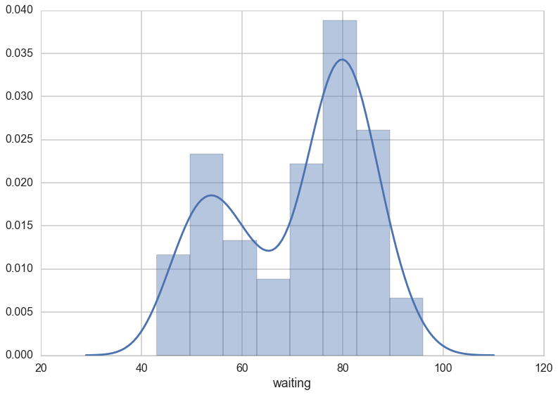


Visually, there seem to be two components to the waiting time, so let us model this using a mixture of two gaussians. Remember that this is a unsupervized model, and all we are doing is modelling $p(x)$ , with the assumption that there are two clusters and a hidden variable $z$ that indexes them.


```python
with pm.Model() as ofmodel:
    p1 = pm.Uniform('p', 0, 1)
    p2 = 1 - p1
    p = tt.stack([p1, p2])
    assignment = pm.Categorical("assignment", p, 
                                shape=ofdata.shape[0])
    sds = pm.Uniform("sds", 0, 100, shape=2)
    centers = pm.Normal("centers", 
                        mu=np.array([50, 80]), 
                        sd=np.array([20, 20]), 
                        shape=2)
    
    # and to combine it with the observations:
    observations = pm.Normal("obs", mu=centers[assignment], sd=sds[assignment], observed=ofdata.waiting)
```


```python
with ofmodel:
    step1 = pm.Metropolis(vars=[p, sds, centers])
    step2 = pm.ElemwiseCategorical(vars=[assignment])
    oftrace_full = pm.sample(10000, step=[step1, step2], njobs=2)
```


    //anaconda/envs/py35/lib/python3.5/site-packages/ipykernel/__main__.py:3: DeprecationWarning: ElemwiseCategorical is deprecated, switch to CategoricalGibbsMetropolis.
      app.launch_new_instance()
    100%|██████████| 10000/10000 [01:18<00:00, 128.16it/s]


```python
oftrace = oftrace_full[2000::5]
pm.traceplot(oftrace);
```


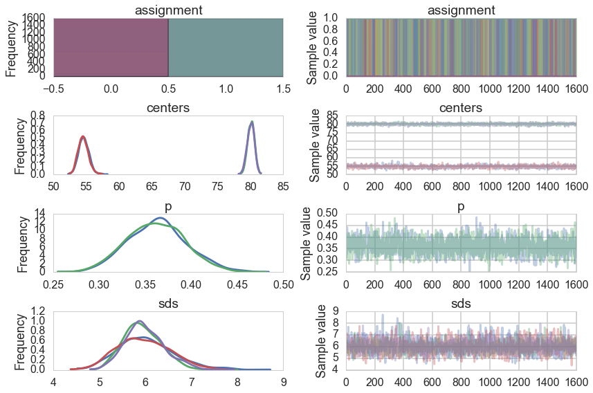


```python
pm.autocorrplot(oftrace, varnames=['p', 'centers', 'sds']);
```


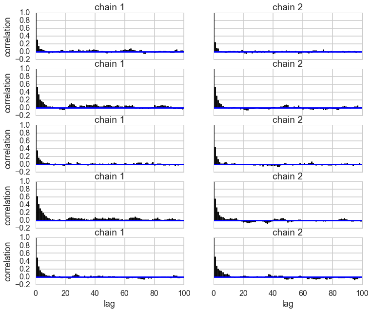


```python
oftrace['centers'].mean(axis=0)
```


    array([ 54.6205673 ,  80.06732802])


We can visualize the two clusters, suitably scales by the category-belonging probability by taking the posterior means. Note that this misses any smearing that might go into making the posterior predictive


```python
from scipy.stats import norm
x = np.linspace(20, 120, 500)
# for pretty colors later in the book.
colors = ["#348ABD", "#A60628"] if oftrace['centers'][-1, 0] > oftrace['centers'][-1, 1] \
    else ["#A60628", "#348ABD"]

posterior_center_means = oftrace['centers'].mean(axis=0)
posterior_std_means = oftrace['sds'].mean(axis=0)
posterior_p_mean = oftrace["p"].mean()

plt.hist(ofdata.waiting, bins=20, histtype="step", normed=True, color="k",
     lw=2, label="histogram of data")
y = posterior_p_mean * norm.pdf(x, loc=posterior_center_means[0],
                                scale=posterior_std_means[0])
plt.plot(x, y, label="Cluster 0 (using posterior-mean parameters)", lw=3)
plt.fill_between(x, y, color=colors[1], alpha=0.3)

y = (1 - posterior_p_mean) * norm.pdf(x, loc=posterior_center_means[1],
                                      scale=posterior_std_means[1])
plt.plot(x, y, label="Cluster 1 (using posterior-mean parameters)", lw=3)
plt.fill_between(x, y, color=colors[0], alpha=0.3)

plt.legend(loc="upper left")
plt.title("Visualizing Clusters using posterior-mean parameters");
```


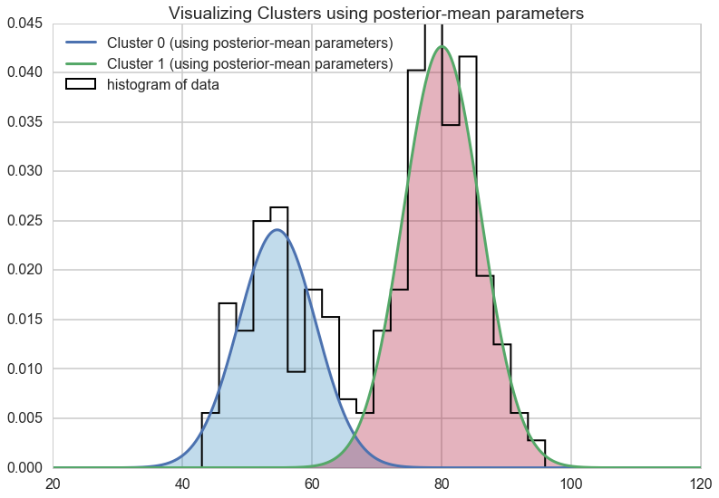


## A tetchy 3 Gaussian Model

Let us set up our data.


```python
mu_true = np.array([0, 10, 20])
sigma_true = np.array([3, 3, 3])
lambda_true = np.array([.33, .33, .34])
n = 1000
from scipy.stats import multinomial
# Simulate from each distribution according to mixing proportion psi
z = multinomial.rvs(1, lambda_true, size=n)
data=np.array([np.random.normal(mu_true[i.astype('bool')][0], sigma_true[i.astype('bool')][0]) for i in z])
sns.distplot(data, bins=50);
```


    //anaconda/envs/py35/lib/python3.5/site-packages/statsmodels/nonparametric/kdetools.py:20: VisibleDeprecationWarning: using a non-integer number instead of an integer will result in an error in the future
      y = X[:m/2+1] + np.r_[0,X[m/2+1:],0]*1j


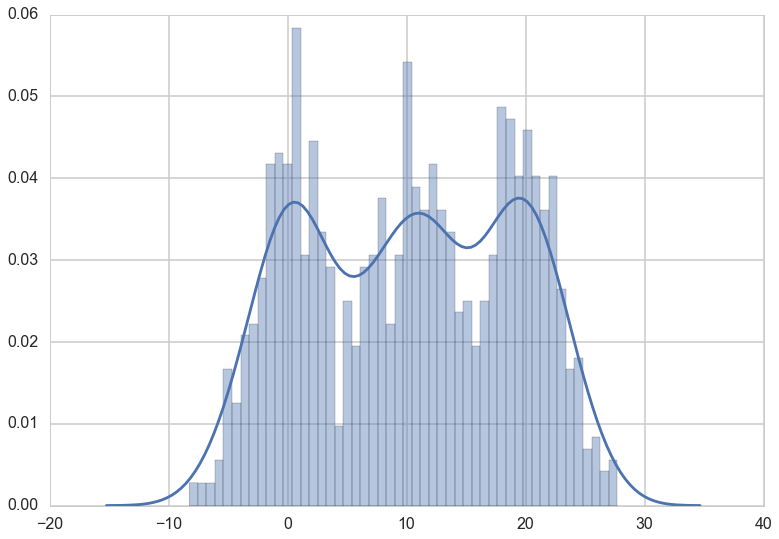


```python
np.savetxt("data/3g.dat", data)
```


In a similar way to before, we set up our sampling. The main difference is the direct use of the Dirichlet as a prior.


```python
with pm.Model() as mof:
    p = pm.Dirichlet('p', a=np.array([1., 1., 1.]), shape=3)


    # cluster centers
    means = pm.Normal('means', mu=[0,10,20], sd=5, shape=3)


    sds = pm.Uniform('sds', lower=0, upper=20, shape=3)

    # latent cluster of each observation
    category = pm.Categorical('category',
                              p=p,
                              shape=data.shape[0])

    # likelihood for each observed value
    points = pm.Normal('obs',
                       mu=means[category],
                       sd=sds[category],
                       observed=data)

```


```python
with mof:
    step1 = pm.Metropolis(vars=[p, sds, means])
    step2 = pm.ElemwiseCategorical(vars=[category])
    tripletrace_full = pm.sample(10000, step=[step1, step2], njobs=2)
```


    //anaconda/envs/py35/lib/python3.5/site-packages/ipykernel/__main__.py:3: DeprecationWarning: ElemwiseCategorical is deprecated, switch to CategoricalGibbsMetropolis.
      app.launch_new_instance()
    100%|██████████| 10000/10000 [03:10<00:00, 61.94it/s]


```python
trace_mof=tripletrace_full[2000::5]
pm.traceplot(trace_mof);
```


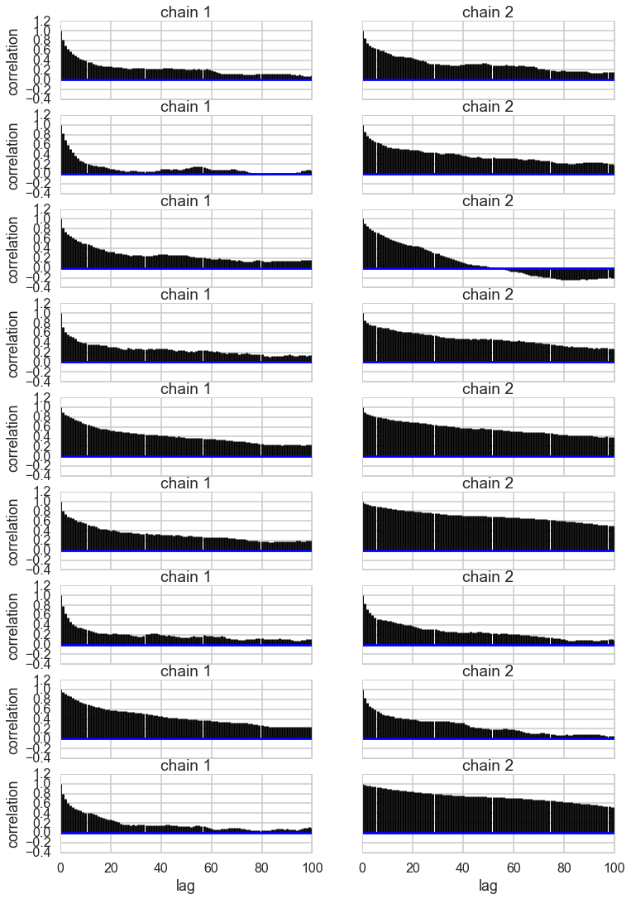


```python
pm.autocorrplot(trace_mof, varnames=['means', 'p', 'sds']);
```


## Problems with clusters and sampling

Some of the traces seem ok, but the autocorrelation is quite bad. This is because there are major problems with using MCMC for clustering.

These are firstly, the lack of parameter identifiability (the so called label-switching problem) and secondly, the multimodality of the posteriors.

We have seen non-identifiability before. Switching labels on the means and z's, for example, does not change the likelihoods. The problem with this is that cluster parameters cannot be compared across chains: what might be a cluster parameter in one chain could well belong to the other cluster in the second chain. Even within a single chain, indices might swam leading to a tell tale back and forth in the traces for long chains or data not cleanly separated.

Also, the (joint) posteriors can be highly multimodal. One form of multimodality is the non-identifiability, though even without identifiability issues the posteriors are highly multimodal.

To quote the Stan manual:
>Bayesian inference fails in cases of high multimodality because there is no way to visit all of the modes in the posterior in appropriate proportions and thus no way to evaluate integrals involved in posterior predictive inference.
In light of these two problems, the advice often given in fitting clustering models is to try many different initializations and select the sample with the highest overall probability. It is also popular to use optimization-based point estimators such as expectation maximization or variational Bayes, which can be much more efficient than sampling-based approaches.


```python
trace_mof['category'].mean()
```


    1.0099968749999999


### Some mitigation via potentials in pymc3

The idea behinf a `Potential` is something that is not part of the likelihood, but enforces a constraint by setting the probability to 0 if the constraint is violated. We use it here to give each cluster some membership and to order the means to remove the non-identifiability problem. See below for how its used.

But this is not a panacea. Sampling is still vety hard.


```python
import theano.tensor as tt
with pm.Model() as mof2:
    p = pm.Dirichlet('p', a=np.array([1., 1., 1.]), shape=3)
    # ensure all clusters have some points
    p_min_potential = pm.Potential('p_min_potential', tt.switch(tt.min(p) < .1, -np.inf, 0))

    # cluster centers
    means = pm.Normal('means', mu=[0, 10, 20], sd=5, shape=3)

    order_means_potential = pm.Potential('order_means_potential',
                                         tt.switch(means[1]-means[0] < 0, -np.inf, 0)
                                         + tt.switch(means[2]-means[1] < 0, -np.inf, 0))
                                         
    # measurement error
    sds = pm.Uniform('sds', lower=0, upper=20, shape=3)

    # latent cluster of each observation
    category = pm.Categorical('category',
                              p=p,
                              shape=data.shape[0])

    # likelihood for each observed value
    points = pm.Normal('obs',
                       mu=means[category],
                       sd=sds[category],
                       observed=data)

```


```python
with mof2:
    step1 = pm.Metropolis(vars=[p, sds, means])
    step2 = pm.ElemwiseCategorical(vars=[category])
    tripletrace_full2 = pm.sample(10000, step=[step1, step2], njobs=2)
```


    //anaconda/envs/py35/lib/python3.5/site-packages/ipykernel/__main__.py:3: DeprecationWarning: ElemwiseCategorical is deprecated, switch to CategoricalGibbsMetropolis.
      app.launch_new_instance()
    100%|██████████| 10000/10000 [02:57<00:00, 56.23it/s]


```python
trace_mof2 = tripletrace_full2[2000::5]
pm.traceplot(trace_mof2);
```


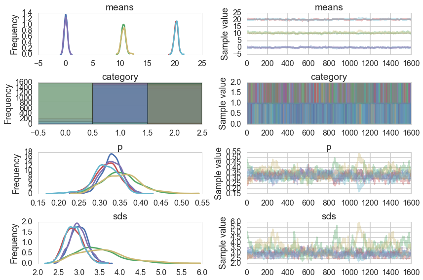


```python
pm.autocorrplot(trace_mof2, varnames=["means", "p", "sds"]);
```


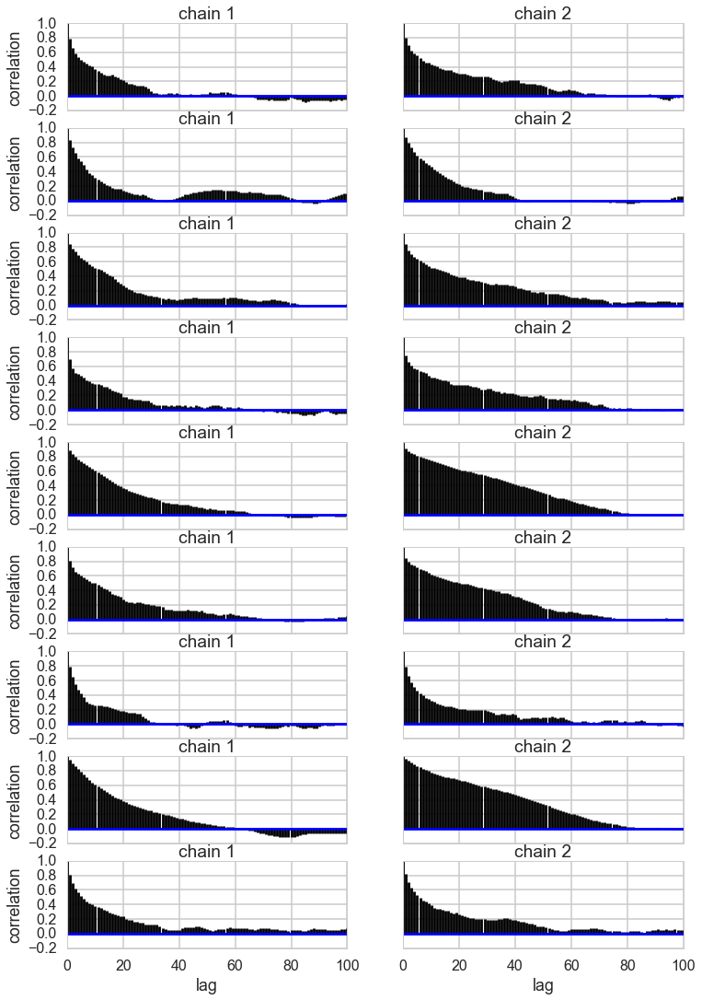


```python
with mof2:
    step1 = pm.Metropolis(vars=[p, sds, means])
    step2 = pm.ElemwiseCategorical(vars=[category])
    trace_mof_big = pm.sample(20000, step=[step1, step2], trace=tripletrace_full2, njobs=2)
```


    //anaconda/envs/py35/lib/python3.5/site-packages/ipykernel/__main__.py:3: DeprecationWarning: ElemwiseCategorical is deprecated, switch to CategoricalGibbsMetropolis.
      app.launch_new_instance()
    100%|██████████| 20000/20000 [06:17<00:00, 53.02it/s]


```python
len(trace_mof_big), trace_mof_big['means'].shape
```


    (30000, (60000, 3))


```python
trace_mof21 = trace_mof_big[3000::10]
trace_mof21['means'].shape
```


    (5400, 3)


```python
pm.traceplot(trace_mof21);
```


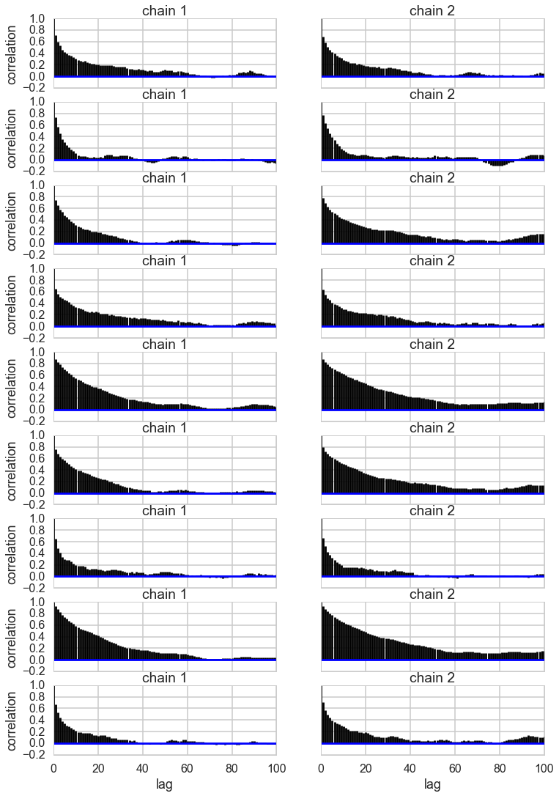


```python
pm.autocorrplot(trace_mof21, varnames=["means", "p", "sds"]);
```


We do much better now

## Supervised and semi-supervised Learning

In other notes, we used mixture models to categorize the various types of learning. The key difference was how we wrote the likelihoods. Lets use those likelihoods to untertake sampling in supervised and semi-supervised ways. We have already seen unsupervised sampling

We'll use the heights-weights data set as we do have a story for why these outght to be separately gaussianly distributed for men and women.


```python
df=pd.read_csv("data/01_heights_weights_genders.csv")
df.head()
```


<div>
<table border="1" class="dataframe">
  <thead>
    <tr style="text-align: right;">
      <th></th>
      <th>Gender</th>
      <th>Height</th>
      <th>Weight</th>
    </tr>
  </thead>
  <tbody>
    <tr>
      <th>0</th>
      <td>Male</td>
      <td>73.847017</td>
      <td>241.893563</td>
    </tr>
    <tr>
      <th>1</th>
      <td>Male</td>
      <td>68.781904</td>
      <td>162.310473</td>
    </tr>
    <tr>
      <th>2</th>
      <td>Male</td>
      <td>74.110105</td>
      <td>212.740856</td>
    </tr>
    <tr>
      <th>3</th>
      <td>Male</td>
      <td>71.730978</td>
      <td>220.042470</td>
    </tr>
    <tr>
      <th>4</th>
      <td>Male</td>
      <td>69.881796</td>
      <td>206.349801</td>
    </tr>
  </tbody>
</table>
</div>


```python
df.describe()
```


<div>
<table border="1" class="dataframe">
  <thead>
    <tr style="text-align: right;">
      <th></th>
      <th>Height</th>
      <th>Weight</th>
    </tr>
  </thead>
  <tbody>
    <tr>
      <th>count</th>
      <td>10000.000000</td>
      <td>10000.000000</td>
    </tr>
    <tr>
      <th>mean</th>
      <td>66.367560</td>
      <td>161.440357</td>
    </tr>
    <tr>
      <th>std</th>
      <td>3.847528</td>
      <td>32.108439</td>
    </tr>
    <tr>
      <th>min</th>
      <td>54.263133</td>
      <td>64.700127</td>
    </tr>
    <tr>
      <th>25%</th>
      <td>63.505620</td>
      <td>135.818051</td>
    </tr>
    <tr>
      <th>50%</th>
      <td>66.318070</td>
      <td>161.212928</td>
    </tr>
    <tr>
      <th>75%</th>
      <td>69.174262</td>
      <td>187.169525</td>
    </tr>
    <tr>
      <th>max</th>
      <td>78.998742</td>
      <td>269.989699</td>
    </tr>
  </tbody>
</table>
</div>


A KDEplot confirms our intuition


```python
sns.kdeplot(df.Weight, df.Height)
```


    
    Exception in thread Thread-8:
    Traceback (most recent call last):
      File "//anaconda/envs/py35/lib/python3.5/threading.py", line 914, in _bootstrap_inner
        self.run()
      File "//anaconda/envs/py35/lib/python3.5/site-packages/tqdm/_tqdm.py", line 102, in run
        for instance in self.tqdm_cls._instances:
      File "//anaconda/envs/py35/lib/python3.5/_weakrefset.py", line 60, in __iter__
        for itemref in self.data:
    RuntimeError: Set changed size during iteration
    


    <matplotlib.axes._subplots.AxesSubplot at 0x12799e7b8>


    


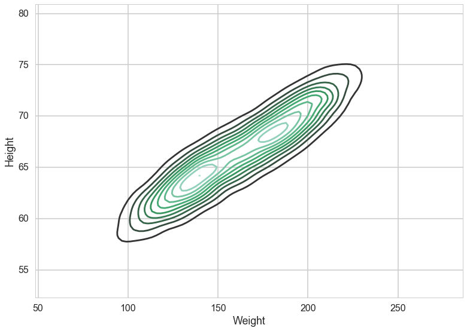


To keep things simple, we'll keep to one dimension by sticking with the weight marginal. Plotting it, there definitely seems to be a double humped distribution:


```python
sns.kdeplot(df.Weight)
plt.hist(df.Weight, bins=100, alpha=0.2, normed=True);
```


    //anaconda/envs/py35/lib/python3.5/site-packages/statsmodels/nonparametric/kdetools.py:20: VisibleDeprecationWarning: using a non-integer number instead of an integer will result in an error in the future
      y = X[:m/2+1] + np.r_[0,X[m/2+1:],0]*1j


We do the train-test split. Notice we will keep a very small number of points in the training set.


```python
makesmall=np.random.choice(range(df.shape[0]), size=500, replace=False)
datax=df.Weight.values
dataz=1*(df.Gender=='Male')
datax=datax[makesmall]
dataz=dataz.values[makesmall]
from sklearn.cross_validation import train_test_split
itr, ite = train_test_split(range(dataz.shape[0]), train_size=0.05, stratify=dataz)
xte=datax[ite]
xtr=datax[itr]
zte=dataz[ite]
ztr=dataz[itr]

```


    //anaconda/envs/py35/lib/python3.5/site-packages/sklearn/cross_validation.py:44: DeprecationWarning: This module was deprecated in version 0.18 in favor of the model_selection module into which all the refactored classes and functions are moved. Also note that the interface of the new CV iterators are different from that of this module. This module will be removed in 0.20.
      "This module will be removed in 0.20.", DeprecationWarning)


```python
zte.shape, zte.mean(), ztr.mean(), ztr.shape
```


    ((475,), 0.50736842105263158, 0.52000000000000002, (25,))


We use 2-D categoricals to make cluster assignments. Notice that these training assignments are also observed stochastics now, in addition to the $x$. 


```python
with pm.Model() as classmodel1:
    p1 = pm.Uniform('p', 0, 1)
    p2 = 1 - p1
    p = tt.stack([p1, p2])
    assignment_tr = pm.Categorical("assignment_tr", p, 
                                observed=ztr)
    sds = pm.Uniform("sds", 0, 100, shape=2)
    centers = pm.Normal("centers", 
                        mu=np.array([130, 170]), 
                        sd=np.array([20, 20]), 
                        shape=2)
    p_min_potential = pm.Potential('lam_min_potential', tt.switch(tt.min(p) < .1, -np.inf, 0))
    order_centers_potential = pm.Potential('order_centers_potential',
                                         tt.switch(centers[1]-centers[0] < 0, -np.inf, 0))
    
    # and to combine it with the observations:
    observations = pm.Normal("obs", mu=centers[assignment_tr], sd=sds[assignment_tr], observed=xtr)
    
```


```python
with classmodel1:
    step1 = pm.Metropolis(vars=[p, sds, centers])
    trace_cm1_full = pm.sample(10000, step=[step1], njobs=2)
```


    
    
      0%|          | 0/10000 [00:00<?, ?it/s]
    
      0%|          | 1/10000 [00:00<23:25,  7.11it/s]
    
      0%|          | 44/10000 [00:00<16:26, 10.09it/s]
    
      1%|          | 87/10000 [00:00<11:34, 14.27it/s]
    
      1%|▏         | 148/10000 [00:00<08:08, 20.19it/s]
    
      2%|▏         | 203/10000 [00:00<05:45, 28.38it/s]
    
      3%|▎         | 265/10000 [00:00<04:04, 39.76it/s]
    
      4%|▎         | 356/10000 [00:00<02:52, 55.76it/s]
    
      5%|▍         | 457/10000 [00:00<02:02, 77.81it/s]
    
      6%|▌         | 560/10000 [00:00<01:27, 107.67it/s]
    
      7%|▋         | 655/10000 [00:01<01:03, 146.61it/s]
    
      8%|▊         | 762/10000 [00:01<00:46, 197.75it/s]
    
      9%|▊         | 854/10000 [00:01<00:35, 256.77it/s]
    
      9%|▉         | 944/10000 [00:01<00:28, 313.74it/s]
    
     10%|█         | 1027/10000 [00:01<00:25, 352.42it/s]
    
     11%|█         | 1100/10000 [00:01<00:22, 395.29it/s]
    
     12%|█▏        | 1168/10000 [00:01<00:20, 436.41it/s]
    
     12%|█▏        | 1240/10000 [00:01<00:17, 494.29it/s]
    
     13%|█▎        | 1307/10000 [00:02<00:16, 535.89it/s]
    
     14%|█▍        | 1385/10000 [00:02<00:14, 591.29it/s]
    
     15%|█▍        | 1455/10000 [00:02<00:14, 604.40it/s]
    
     15%|█▌        | 1524/10000 [00:02<00:14, 603.13it/s]
    
     16%|█▌        | 1591/10000 [00:02<00:13, 619.93it/s]
    
     17%|█▋        | 1698/10000 [00:02<00:11, 709.12it/s]
    
     18%|█▊        | 1819/10000 [00:02<00:10, 809.57it/s]
    
     19%|█▉        | 1939/10000 [00:02<00:08, 896.97it/s]
    
     21%|██        | 2053/10000 [00:02<00:08, 957.95it/s]
    
     22%|██▏       | 2171/10000 [00:02<00:07, 1014.27it/s]
    
     23%|██▎       | 2280/10000 [00:03<00:08, 962.42it/s] 
    
     24%|██▍       | 2382/10000 [00:03<00:09, 768.74it/s]
    
     25%|██▍       | 2469/10000 [00:03<00:10, 710.77it/s]
    
     25%|██▌       | 2548/10000 [00:03<00:11, 668.23it/s]
    
     26%|██▌       | 2621/10000 [00:03<00:11, 653.76it/s]
    
     27%|██▋       | 2691/10000 [00:03<00:11, 649.73it/s]
    
     28%|██▊       | 2765/10000 [00:03<00:10, 673.93it/s]
    
     28%|██▊       | 2835/10000 [00:03<00:11, 648.31it/s]
    
     29%|██▉       | 2903/10000 [00:04<00:10, 656.74it/s]
    
     30%|██▉       | 2970/10000 [00:04<00:10, 649.26it/s]
    
     30%|███       | 3045/10000 [00:04<00:10, 675.38it/s]
    
     32%|███▏      | 3162/10000 [00:04<00:08, 773.13it/s]
    
     33%|███▎      | 3278/10000 [00:04<00:07, 859.03it/s]
    
     34%|███▍      | 3394/10000 [00:04<00:07, 930.42it/s]
    
     35%|███▌      | 3502/10000 [00:04<00:06, 969.43it/s]
    
     36%|███▌      | 3604/10000 [00:04<00:06, 949.80it/s]
    
     37%|███▋      | 3703/10000 [00:04<00:07, 819.94it/s]
    
     38%|███▊      | 3791/10000 [00:05<00:07, 818.43it/s]
    
     39%|███▉      | 3902/10000 [00:05<00:06, 886.95it/s]
    
     40%|███▉      | 3996/10000 [00:05<00:06, 872.33it/s]
    
     41%|████      | 4087/10000 [00:05<00:07, 799.16it/s]
    
     42%|████▏     | 4171/10000 [00:05<00:08, 728.18it/s]
    
     42%|████▏     | 4248/10000 [00:05<00:08, 682.88it/s]
    
     43%|████▎     | 4320/10000 [00:05<00:09, 617.84it/s]
    
     44%|████▍     | 4386/10000 [00:05<00:09, 611.00it/s]
    
     45%|████▍     | 4452/10000 [00:06<00:08, 624.39it/s]
    
     45%|████▌     | 4517/10000 [00:06<00:09, 604.25it/s]
    
     46%|████▌     | 4582/10000 [00:06<00:08, 616.14it/s]
    
     47%|████▋     | 4662/10000 [00:06<00:08, 661.14it/s]
    
     47%|████▋     | 4737/10000 [00:06<00:07, 682.71it/s]
    
     48%|████▊     | 4807/10000 [00:06<00:07, 664.89it/s]
    
     49%|████▉     | 4903/10000 [00:06<00:06, 731.16it/s]
    
     50%|████▉     | 4992/10000 [00:06<00:06, 770.64it/s]
    
     51%|█████     | 5097/10000 [00:06<00:05, 836.47it/s]
    
     52%|█████▏    | 5202/10000 [00:06<00:05, 889.85it/s]
    
     53%|█████▎    | 5318/10000 [00:07<00:04, 953.55it/s]
    
     54%|█████▍    | 5417/10000 [00:07<00:05, 871.96it/s]
    
     55%|█████▌    | 5509/10000 [00:07<00:05, 804.87it/s]
    
     56%|█████▌    | 5607/10000 [00:07<00:05, 850.19it/s]
    
     57%|█████▋    | 5716/10000 [00:07<00:04, 909.22it/s]
    
     58%|█████▊    | 5823/10000 [00:07<00:04, 952.13it/s]
    
     59%|█████▉    | 5922/10000 [00:07<00:04, 841.25it/s]
    
     60%|██████    | 6011/10000 [00:07<00:05, 765.43it/s]
    
     61%|██████    | 6092/10000 [00:08<00:05, 732.46it/s]
    
     62%|██████▏   | 6169/10000 [00:08<00:05, 696.75it/s]
    
     62%|██████▏   | 6242/10000 [00:08<00:05, 649.94it/s]
    
     63%|██████▎   | 6334/10000 [00:08<00:05, 710.96it/s]
    
     64%|██████▍   | 6436/10000 [00:08<00:04, 781.97it/s]
    
     65%|██████▌   | 6533/10000 [00:08<00:04, 828.29it/s]
    
     66%|██████▋   | 6636/10000 [00:08<00:03, 878.85it/s]
    
     67%|██████▋   | 6728/10000 [00:08<00:04, 763.83it/s]
    
     68%|██████▊   | 6810/10000 [00:09<00:04, 673.60it/s]
    
     69%|██████▉   | 6886/10000 [00:09<00:04, 696.85it/s]
    
     70%|██████▉   | 6960/10000 [00:09<00:04, 697.54it/s]
    
     70%|███████   | 7033/10000 [00:09<00:04, 661.61it/s]
    
     71%|███████   | 7102/10000 [00:09<00:04, 623.84it/s]
    
     72%|███████▏  | 7167/10000 [00:09<00:04, 602.47it/s]
    
     72%|███████▏  | 7241/10000 [00:09<00:04, 637.02it/s]
    
     73%|███████▎  | 7307/10000 [00:09<00:04, 624.55it/s]
    
     74%|███████▍  | 7377/10000 [00:09<00:04, 643.91it/s]
    
     74%|███████▍  | 7449/10000 [00:10<00:03, 663.71it/s]
    
     75%|███████▌  | 7517/10000 [00:10<00:04, 601.17it/s]
    
     76%|███████▌  | 7579/10000 [00:10<00:04, 596.81it/s]
    
     76%|███████▋  | 7644/10000 [00:10<00:03, 609.20it/s]
    
     77%|███████▋  | 7722/10000 [00:10<00:03, 651.03it/s]
    
     78%|███████▊  | 7827/10000 [00:10<00:02, 733.88it/s]
    
     79%|███████▉  | 7929/10000 [00:10<00:02, 800.34it/s]
    
     80%|████████  | 8027/10000 [00:10<00:02, 846.71it/s]
    
     81%|████████▏ | 8131/10000 [00:10<00:02, 896.35it/s]
    
     82%|████████▏ | 8225/10000 [00:11<00:02, 771.37it/s]
    
     83%|████████▎ | 8308/10000 [00:11<00:02, 734.95it/s]
    
     84%|████████▍ | 8386/10000 [00:11<00:02, 735.24it/s]
    
     85%|████████▍ | 8463/10000 [00:11<00:02, 591.97it/s]
    
     85%|████████▌ | 8529/10000 [00:11<00:02, 591.79it/s]
    
     86%|████████▌ | 8596/10000 [00:11<00:02, 609.83it/s]
    
     87%|████████▋ | 8661/10000 [00:11<00:02, 613.85it/s]
    
     87%|████████▋ | 8725/10000 [00:11<00:02, 599.44it/s]
    
     88%|████████▊ | 8787/10000 [00:11<00:02, 582.73it/s]
    
     88%|████████▊ | 8847/10000 [00:12<00:01, 580.41it/s]
    
     89%|████████▉ | 8906/10000 [00:12<00:01, 579.92it/s]
    
     90%|████████▉ | 8965/10000 [00:12<00:01, 579.94it/s]
    
     90%|█████████ | 9024/10000 [00:12<00:01, 582.85it/s]
    
     91%|█████████ | 9099/10000 [00:12<00:01, 624.28it/s]
    
     92%|█████████▏| 9199/10000 [00:12<00:01, 703.24it/s]
    
     93%|█████████▎| 9295/10000 [00:12<00:00, 764.19it/s]
    
     94%|█████████▍| 9398/10000 [00:12<00:00, 827.96it/s]
    
     95%|█████████▍| 9487/10000 [00:12<00:00, 844.29it/s]
    
     96%|█████████▌| 9575/10000 [00:13<00:00, 774.97it/s]
    
     97%|█████████▋| 9656/10000 [00:13<00:00, 722.05it/s]
    
     97%|█████████▋| 9736/10000 [00:13<00:00, 742.51it/s]
    
     98%|█████████▊| 9841/10000 [00:13<00:00, 813.45it/s]
    
     99%|█████████▉| 9931/10000 [00:13<00:00, 837.55it/s]
    
    100%|██████████| 10000/10000 [00:13<00:00, 737.42it/s]


```python
trace_cm1 = trace_cm1_full[2000::5]
pm.traceplot(trace_cm1);
```


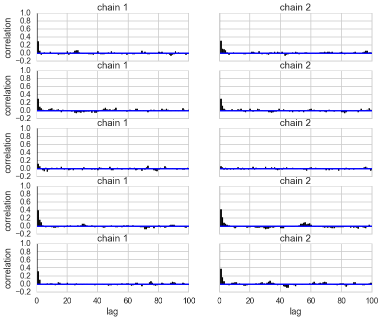


```python
pm.autocorrplot(trace_cm1);
```


```python
center_trace = trace_cm1["centers"]
std_trace = trace_cm1["sds"]
#identify the clusters
colors = ["#348ABD", "#A60628"] \
if center_trace[-1, 0] > center_trace[-1, 1] \
    else ["#A60628", "#348ABD"]
norm = sp.stats.norm
x = np.arange(0, 300, 1)
posterior_center_means = center_trace.mean(axis=0)
posterior_std_means = std_trace.mean(axis=0)
posterior_p_mean = 1 - ztr.mean()


y = posterior_p_mean * norm.pdf(x, loc=posterior_center_means[0],
                                scale=posterior_std_means[0])
plt.plot(x, y, label="Cluster 0 (using posterior-mean parameters)", color=colors[1], lw=3)
plt.fill_between(x, y, color=colors[1], alpha=0.3)

y = (1 - posterior_p_mean) * norm.pdf(x, loc=posterior_center_means[1],
                                      scale=posterior_std_means[1])
plt.plot(x, y, label="Cluster 1 (using posterior-mean parameters)", color=colors[0], lw=3)
plt.fill_between(x, y, color=colors[0], alpha=0.3)
plt.hist(xtr, bins=10, histtype="step", normed=True, color="k",
     lw=2, label="histogram of training data")
# plt.hist(xte, bins=20, histtype="step", normed=True, color="k",
#      lw=2, label="histogram of  test data")
plt.legend(loc="upper right")
plt.title("Visualizing Clusters using posterior-mean parameters")
```


    <matplotlib.text.Text at 0x127507f60>


We use the $p(x \vert z)$ to do our classification. What we really want is $p(z \vert x)$, but we can use bayes theorem to inver this, as shown in the diagram below.


```python
xgivenz0 = lambda x: norm.pdf(x, loc=posterior_center_means[0],
                                scale=posterior_std_means[0])
xgivenz1 = lambda x: norm.pdf(x, loc=posterior_center_means[1],
                                      scale=posterior_std_means[1])
zpred1 = 1*(xgivenz1(xte) > xgivenz0(xte))
from sklearn.metrics import confusion_matrix, accuracy_score
confusion_matrix(zte, zpred1)
```


    array([[199,  35],
           [ 12, 229]])


```python
accuracy_score(zte, zpred1)
```


    0.90105263157894733


## Semi-Supervised Learning

In the previous section we did the work on the testing set separately. Here we'd like to model the fact that we have a partial likelihood available for the testing set: we have observed the $x$s, but not the $z$s.

Thus in our model we will include both training and testing $x$s, but only training $z$s as observations, fitting for the testing $z$s.
We now want the trace of the testing assignments. That is we want $p(z \vert x)$ and we'll use the MCMC model to do the whole bayes theorem inversion for us!


```python
with pm.Model() as classmodel2:
    p1 = pm.Uniform('p', 0, 1)
    p2 = 1 - p1
    p = tt.stack([p1, p2])
    assignment_tr = pm.Categorical("assignment_tr", p, 
                                observed=ztr)
    assignment_te = pm.Categorical("assignment_te", p, 
                                shape=xte.shape[0])
    sds = pm.Uniform("sds", 0, 100, shape=2)
    centers = pm.Normal("centers", 
                        mu=np.array([130, 170]), 
                        sd=np.array([20, 20]), 
                        shape=2)
    p_min_potential = pm.Potential('lam_min_potential', tt.switch(tt.min(p) < .1, -np.inf, 0))
    order_centers_potential = pm.Potential('order_centers_potential',
                                         tt.switch(centers[1]-centers[0] < 0, -np.inf, 0))
    
    # and to combine it with the observations:
    observations_tr = pm.Normal("obs_tr", mu=centers[assignment_tr], sd=sds[assignment_tr], observed=xtr)
    observations_te = pm.Normal("obs_te", mu=centers[assignment_te], sd=sds[assignment_te], observed=xte)
```


```python
with classmodel2:
    step1 = pm.Metropolis(vars=[p, sds, centers])
    step2 = pm.ElemwiseCategorical(vars=[assignment_te])
    trace_cm2_full = pm.sample(10000, step=[step1, step2], njobs=2)
```


    //anaconda/envs/py35/lib/python3.5/site-packages/ipykernel/__main__.py:3: DeprecationWarning: ElemwiseCategorical is deprecated, switch to CategoricalGibbsMetropolis.
      app.launch_new_instance()
    
    
      0%|          | 0/10000 [00:00<?, ?it/s]
    
      0%|          | 1/10000 [00:00<23:48,  7.00it/s]
    
      0%|          | 8/10000 [00:00<17:25,  9.56it/s]
    
      0%|          | 16/10000 [00:00<12:53, 12.91it/s]
    
      0%|          | 24/10000 [00:00<09:40, 17.17it/s]
    
      0%|          | 32/10000 [00:00<07:24, 22.40it/s]
    
      0%|          | 41/10000 [00:00<05:47, 28.65it/s]
    
      0%|          | 50/10000 [00:00<04:38, 35.73it/s]
    
      1%|          | 58/10000 [00:00<03:55, 42.14it/s]
    
      1%|          | 66/10000 [00:01<03:28, 47.72it/s]
    
      1%|          | 74/10000 [00:01<03:04, 53.75it/s]
    
      1%|          | 82/10000 [00:01<02:49, 58.42it/s]
    
      1%|          | 90/10000 [00:01<02:36, 63.37it/s]
    
      1%|          | 99/10000 [00:01<02:22, 69.42it/s]
    
      1%|          | 107/10000 [00:01<02:31, 65.34it/s]
    
      1%|          | 115/10000 [00:01<02:42, 60.84it/s]
    
      1%|          | 122/10000 [00:01<02:49, 58.30it/s]
    
      1%|▏         | 129/10000 [00:01<02:47, 59.10it/s]
    
      1%|▏         | 137/10000 [00:02<02:36, 63.05it/s]
    
      1%|▏         | 146/10000 [00:02<02:23, 68.74it/s]
    
      2%|▏         | 154/10000 [00:02<02:32, 64.76it/s]
    
      2%|▏         | 161/10000 [00:02<02:40, 61.33it/s]
    
      2%|▏         | 168/10000 [00:02<02:46, 59.00it/s]
    
      2%|▏         | 176/10000 [00:02<02:34, 63.47it/s]
    
      2%|▏         | 185/10000 [00:02<02:21, 69.32it/s]
    
      2%|▏         | 194/10000 [00:02<02:12, 73.91it/s]
    
      2%|▏         | 203/10000 [00:02<02:06, 77.63it/s]
    
      2%|▏         | 212/10000 [00:03<02:01, 80.27it/s]
    
      2%|▏         | 221/10000 [00:03<02:20, 69.81it/s]
    
      2%|▏         | 229/10000 [00:03<02:38, 61.83it/s]
    
      2%|▏         | 236/10000 [00:03<02:33, 63.56it/s]
    
      2%|▏         | 244/10000 [00:03<02:24, 67.60it/s]
    
      3%|▎         | 252/10000 [00:03<02:18, 70.43it/s]
    
      3%|▎         | 260/10000 [00:03<02:25, 66.99it/s]
    
      3%|▎         | 267/10000 [00:04<02:38, 61.25it/s]
    
      3%|▎         | 274/10000 [00:04<02:43, 59.43it/s]
    
      3%|▎         | 282/10000 [00:04<02:34, 62.92it/s]
    
      3%|▎         | 291/10000 [00:04<02:22, 68.28it/s]
    
      3%|▎         | 299/10000 [00:04<02:29, 64.83it/s]
    
      3%|▎         | 306/10000 [00:04<02:47, 57.94it/s]
    
      3%|▎         | 313/10000 [00:04<02:51, 56.48it/s]
    
      3%|▎         | 319/10000 [00:04<02:49, 57.03it/s]
    
      3%|▎         | 325/10000 [00:04<02:48, 57.25it/s]
    
      3%|▎         | 331/10000 [00:05<02:47, 57.56it/s]
    
      3%|▎         | 337/10000 [00:05<02:48, 57.24it/s]
    
      3%|▎         | 343/10000 [00:05<02:50, 56.52it/s]
    
      3%|▎         | 349/10000 [00:05<02:50, 56.76it/s]
    
      4%|▎         | 357/10000 [00:05<02:38, 60.89it/s]
    
      4%|▎         | 366/10000 [00:05<02:26, 65.80it/s]
    
      4%|▎         | 374/10000 [00:05<02:18, 69.29it/s]
    
      4%|▍         | 383/10000 [00:05<02:11, 73.05it/s]
    
      4%|▍         | 392/10000 [00:05<02:05, 76.60it/s]
    
      4%|▍         | 400/10000 [00:06<02:23, 67.12it/s]
    
      4%|▍         | 408/10000 [00:06<02:28, 64.50it/s]
    
      4%|▍         | 415/10000 [00:06<02:25, 65.92it/s]
    
      4%|▍         | 424/10000 [00:06<02:15, 70.55it/s]
    
      4%|▍         | 432/10000 [00:06<02:13, 71.85it/s]
    
      4%|▍         | 441/10000 [00:06<02:07, 75.20it/s]
    
      4%|▍         | 449/10000 [00:06<02:05, 76.09it/s]
    
      5%|▍         | 458/10000 [00:06<02:01, 78.57it/s]
    
      5%|▍         | 467/10000 [00:06<01:56, 81.63it/s]
    
      5%|▍         | 476/10000 [00:07<02:01, 78.71it/s]
    
      5%|▍         | 485/10000 [00:07<01:57, 80.99it/s]
    
      5%|▍         | 494/10000 [00:07<01:55, 82.34it/s]
    
      5%|▌         | 503/10000 [00:07<01:57, 80.80it/s]
    
      5%|▌         | 512/10000 [00:07<01:56, 81.13it/s]
    
      5%|▌         | 521/10000 [00:07<02:28, 63.90it/s]
    
      5%|▌         | 528/10000 [00:07<02:42, 58.34it/s]
    
      5%|▌         | 535/10000 [00:08<02:57, 53.38it/s]
    
      5%|▌         | 545/10000 [00:08<02:34, 61.22it/s]
    
      6%|▌         | 552/10000 [00:08<02:30, 62.59it/s]
    
      6%|▌         | 559/10000 [00:08<02:52, 54.85it/s]
    
      6%|▌         | 566/10000 [00:08<02:54, 54.04it/s]
    
      6%|▌         | 572/10000 [00:08<02:53, 54.48it/s]
    
      6%|▌         | 578/10000 [00:08<02:55, 53.59it/s]
    
      6%|▌         | 584/10000 [00:08<02:57, 53.09it/s]
    
      6%|▌         | 591/10000 [00:08<02:51, 54.77it/s]
    
      6%|▌         | 597/10000 [00:09<02:55, 53.56it/s]
    
      6%|▌         | 603/10000 [00:09<02:58, 52.65it/s]
    
      6%|▌         | 609/10000 [00:09<02:57, 53.00it/s]
    
      6%|▌         | 615/10000 [00:09<02:57, 52.87it/s]
    
      6%|▌         | 621/10000 [00:09<03:00, 51.97it/s]
    
      6%|▋         | 628/10000 [00:09<02:50, 55.07it/s]
    
      6%|▋         | 634/10000 [00:09<02:46, 56.14it/s]
    
      6%|▋         | 640/10000 [00:09<02:45, 56.41it/s]
    
      6%|▋         | 647/10000 [00:09<02:37, 59.28it/s]
    
      7%|▋         | 656/10000 [00:10<02:24, 64.85it/s]
    
      7%|▋         | 664/10000 [00:10<02:16, 68.23it/s]
    
      7%|▋         | 672/10000 [00:10<02:15, 68.97it/s]
    
      7%|▋         | 680/10000 [00:10<02:35, 60.10it/s]
    
      7%|▋         | 687/10000 [00:10<02:46, 55.99it/s]
    
      7%|▋         | 693/10000 [00:10<02:51, 54.29it/s]
    
      7%|▋         | 699/10000 [00:10<02:51, 54.19it/s]
    
      7%|▋         | 705/10000 [00:10<02:50, 54.66it/s]
    
      7%|▋         | 712/10000 [00:11<02:40, 57.98it/s]
    
      7%|▋         | 721/10000 [00:11<02:25, 63.90it/s]
    
      7%|▋         | 729/10000 [00:11<02:18, 67.16it/s]
    
      7%|▋         | 737/10000 [00:11<02:11, 70.22it/s]
    
      7%|▋         | 745/10000 [00:11<02:07, 72.75it/s]
    
      8%|▊         | 753/10000 [00:11<02:15, 68.18it/s]
    
      8%|▊         | 760/10000 [00:11<02:37, 58.70it/s]
    
      8%|▊         | 767/10000 [00:11<02:40, 57.35it/s]
    
      8%|▊         | 773/10000 [00:12<02:42, 56.68it/s]
    
      8%|▊         | 779/10000 [00:12<03:05, 49.76it/s]
    
      8%|▊         | 785/10000 [00:12<03:07, 49.04it/s]
    
      8%|▊         | 791/10000 [00:12<03:29, 43.94it/s]
    
      8%|▊         | 797/10000 [00:12<03:20, 45.93it/s]
    
      8%|▊         | 803/10000 [00:12<03:18, 46.45it/s]
    
      8%|▊         | 810/10000 [00:12<03:01, 50.68it/s]
    
      8%|▊         | 818/10000 [00:12<02:43, 56.00it/s]
    
      8%|▊         | 824/10000 [00:13<02:44, 55.92it/s]
    
      8%|▊         | 833/10000 [00:13<02:28, 61.92it/s]
    
      8%|▊         | 840/10000 [00:13<02:33, 59.61it/s]
    
      8%|▊         | 847/10000 [00:13<02:54, 52.39it/s]
    
      9%|▊         | 853/10000 [00:13<02:59, 51.03it/s]
    
      9%|▊         | 859/10000 [00:13<03:17, 46.19it/s]
    
      9%|▊         | 865/10000 [00:13<03:16, 46.60it/s]
    
      9%|▊         | 871/10000 [00:13<03:05, 49.17it/s]
    
      9%|▉         | 879/10000 [00:14<02:45, 54.96it/s]
    
      9%|▉         | 886/10000 [00:14<02:37, 57.82it/s]
    
      9%|▉         | 894/10000 [00:14<02:26, 62.16it/s]
    
      9%|▉         | 901/10000 [00:14<02:22, 63.78it/s]
    
      9%|▉         | 910/10000 [00:14<02:12, 68.37it/s]
    
      9%|▉         | 918/10000 [00:14<02:07, 71.46it/s]
    
      9%|▉         | 926/10000 [00:14<02:19, 65.12it/s]
    
      9%|▉         | 933/10000 [00:14<02:27, 61.60it/s]
    
      9%|▉         | 941/10000 [00:14<02:16, 66.15it/s]
    
      9%|▉         | 949/10000 [00:15<02:11, 68.77it/s]
    
     10%|▉         | 957/10000 [00:15<02:08, 70.40it/s]
    
     10%|▉         | 966/10000 [00:15<02:02, 73.67it/s]
    
     10%|▉         | 974/10000 [00:15<02:08, 70.36it/s]
    
     10%|▉         | 982/10000 [00:15<02:11, 68.53it/s]
    
     10%|▉         | 989/10000 [00:15<02:43, 54.99it/s]
    
     10%|▉         | 995/10000 [00:15<02:58, 50.32it/s]
    
     10%|█         | 1004/10000 [00:15<02:38, 56.69it/s]
    
     10%|█         | 1011/10000 [00:16<02:29, 60.00it/s]
    
     10%|█         | 1018/10000 [00:16<02:23, 62.59it/s]
    
     10%|█         | 1026/10000 [00:16<02:15, 66.06it/s]
    
     10%|█         | 1033/10000 [00:16<02:13, 67.03it/s]
    
     10%|█         | 1041/10000 [00:16<02:08, 69.57it/s]
    
     10%|█         | 1049/10000 [00:16<02:18, 64.64it/s]
    
     11%|█         | 1056/10000 [00:16<02:25, 61.44it/s]
    
     11%|█         | 1064/10000 [00:16<02:16, 65.70it/s]
    
     11%|█         | 1072/10000 [00:16<02:09, 68.70it/s]
    
     11%|█         | 1080/10000 [00:17<02:06, 70.36it/s]
    
     11%|█         | 1088/10000 [00:17<02:02, 72.64it/s]
    
     11%|█         | 1096/10000 [00:17<01:59, 74.47it/s]
    
     11%|█         | 1104/10000 [00:17<01:57, 75.45it/s]
    
     11%|█         | 1112/10000 [00:17<01:56, 76.22it/s]
    
     11%|█         | 1121/10000 [00:17<01:51, 79.49it/s]
    
     11%|█▏        | 1130/10000 [00:17<01:52, 78.92it/s]
    
     11%|█▏        | 1139/10000 [00:17<01:50, 80.32it/s]
    
     11%|█▏        | 1148/10000 [00:17<01:47, 82.29it/s]
    
     12%|█▏        | 1157/10000 [00:18<01:47, 82.37it/s]
    
     12%|█▏        | 1166/10000 [00:18<01:46, 83.09it/s]
    
     12%|█▏        | 1175/10000 [00:18<01:46, 82.68it/s]
    
     12%|█▏        | 1184/10000 [00:18<01:50, 79.45it/s]
    
     12%|█▏        | 1192/10000 [00:18<01:51, 78.86it/s]
    
     12%|█▏        | 1200/10000 [00:18<01:51, 79.05it/s]
    
     12%|█▏        | 1209/10000 [00:18<01:49, 80.41it/s]
    
     12%|█▏        | 1218/10000 [00:18<01:47, 81.56it/s]
    
     12%|█▏        | 1227/10000 [00:18<01:46, 82.47it/s]
    
     12%|█▏        | 1236/10000 [00:19<01:50, 78.98it/s]
    
     12%|█▏        | 1244/10000 [00:19<01:52, 77.79it/s]
    
     13%|█▎        | 1252/10000 [00:19<01:51, 78.44it/s]
    
     13%|█▎        | 1260/10000 [00:19<01:54, 76.41it/s]
    
     13%|█▎        | 1269/10000 [00:19<01:51, 78.47it/s]
    
     13%|█▎        | 1277/10000 [00:19<01:50, 78.79it/s]
    
     13%|█▎        | 1285/10000 [00:19<01:50, 78.77it/s]
    
     13%|█▎        | 1293/10000 [00:19<01:51, 78.20it/s]
    
     13%|█▎        | 1301/10000 [00:19<01:53, 76.33it/s]
    
     13%|█▎        | 1310/10000 [00:19<01:50, 78.35it/s]
    
     13%|█▎        | 1318/10000 [00:20<01:52, 77.41it/s]
    
     13%|█▎        | 1326/10000 [00:20<01:51, 77.77it/s]
    
     13%|█▎        | 1334/10000 [00:20<01:51, 77.96it/s]
    
     13%|█▎        | 1342/10000 [00:20<01:52, 77.15it/s]
    
     14%|█▎        | 1350/10000 [00:20<01:52, 77.19it/s]
    
     14%|█▎        | 1358/10000 [00:20<01:51, 77.66it/s]
    
     14%|█▎        | 1367/10000 [00:20<01:47, 80.38it/s]
    
     14%|█▍        | 1376/10000 [00:20<01:45, 81.48it/s]
    
     14%|█▍        | 1385/10000 [00:20<01:43, 83.18it/s]
    
     14%|█▍        | 1394/10000 [00:21<02:03, 69.66it/s]
    
     14%|█▍        | 1402/10000 [00:21<02:15, 63.57it/s]
    
     14%|█▍        | 1409/10000 [00:21<02:34, 55.77it/s]
    
     14%|█▍        | 1417/10000 [00:21<02:21, 60.78it/s]
    
     14%|█▍        | 1424/10000 [00:21<02:26, 58.72it/s]
    
     14%|█▍        | 1431/10000 [00:21<02:29, 57.43it/s]
    
     14%|█▍        | 1437/10000 [00:21<02:36, 54.77it/s]
    
     14%|█▍        | 1443/10000 [00:21<02:42, 52.79it/s]
    
     14%|█▍        | 1449/10000 [00:22<02:42, 52.72it/s]
    
     15%|█▍        | 1455/10000 [00:22<02:48, 50.69it/s]
    
     15%|█▍        | 1461/10000 [00:22<03:01, 47.05it/s]
    
     15%|█▍        | 1468/10000 [00:22<02:46, 51.29it/s]
    
     15%|█▍        | 1474/10000 [00:22<02:47, 51.04it/s]
    
     15%|█▍        | 1480/10000 [00:22<02:44, 51.81it/s]
    
     15%|█▍        | 1486/10000 [00:22<02:43, 52.16it/s]
    
     15%|█▍        | 1492/10000 [00:22<02:37, 53.96it/s]
    
     15%|█▍        | 1499/10000 [00:23<02:30, 56.57it/s]
    
     15%|█▌        | 1505/10000 [00:23<02:27, 57.48it/s]
    
     15%|█▌        | 1511/10000 [00:23<02:30, 56.42it/s]
    
     15%|█▌        | 1517/10000 [00:23<02:30, 56.27it/s]
    
     15%|█▌        | 1523/10000 [00:23<02:28, 57.23it/s]
    
     15%|█▌        | 1529/10000 [00:23<02:29, 56.53it/s]
    
     15%|█▌        | 1535/10000 [00:23<02:33, 55.19it/s]
    
     15%|█▌        | 1541/10000 [00:23<02:33, 55.16it/s]
    
     15%|█▌        | 1548/10000 [00:23<02:27, 57.13it/s]
    
     16%|█▌        | 1554/10000 [00:24<02:28, 56.78it/s]
    
     16%|█▌        | 1560/10000 [00:24<02:30, 55.97it/s]
    
     16%|█▌        | 1567/10000 [00:24<02:25, 57.85it/s]
    
     16%|█▌        | 1573/10000 [00:24<02:24, 58.45it/s]
    
     16%|█▌        | 1580/10000 [00:24<02:23, 58.59it/s]
    
     16%|█▌        | 1586/10000 [00:24<02:30, 55.74it/s]
    
     16%|█▌        | 1592/10000 [00:24<02:36, 53.71it/s]
    
     16%|█▌        | 1598/10000 [00:24<02:41, 52.11it/s]
    
     16%|█▌        | 1605/10000 [00:24<02:31, 55.58it/s]
    
     16%|█▌        | 1611/10000 [00:25<02:44, 50.95it/s]
    
     16%|█▌        | 1617/10000 [00:25<02:39, 52.57it/s]
    
     16%|█▌        | 1624/10000 [00:25<02:32, 55.04it/s]
    
     16%|█▋        | 1630/10000 [00:25<02:41, 51.69it/s]
    
     16%|█▋        | 1636/10000 [00:25<02:41, 51.86it/s]
    
     16%|█▋        | 1642/10000 [00:25<02:39, 52.31it/s]
    
     16%|█▋        | 1648/10000 [00:25<02:36, 53.32it/s]
    
     17%|█▋        | 1654/10000 [00:25<02:31, 55.07it/s]
    
     17%|█▋        | 1660/10000 [00:25<02:32, 54.58it/s]
    
     17%|█▋        | 1666/10000 [00:26<02:31, 54.87it/s]
    
     17%|█▋        | 1672/10000 [00:26<02:32, 54.73it/s]
    
     17%|█▋        | 1678/10000 [00:26<02:30, 55.37it/s]
    
     17%|█▋        | 1684/10000 [00:26<02:35, 53.59it/s]
    
     17%|█▋        | 1690/10000 [00:26<02:31, 54.73it/s]
    
     17%|█▋        | 1696/10000 [00:26<02:27, 56.13it/s]
    
     17%|█▋        | 1702/10000 [00:26<02:29, 55.44it/s]
    
     17%|█▋        | 1708/10000 [00:26<02:32, 54.30it/s]
    
     17%|█▋        | 1715/10000 [00:26<02:27, 56.00it/s]
    
     17%|█▋        | 1722/10000 [00:27<02:21, 58.71it/s]
    
     17%|█▋        | 1730/10000 [00:27<02:12, 62.19it/s]
    
     17%|█▋        | 1737/10000 [00:27<02:36, 52.71it/s]
    
     17%|█▋        | 1743/10000 [00:27<02:32, 54.02it/s]
    
     18%|█▊        | 1750/10000 [00:27<02:24, 57.27it/s]
    
     18%|█▊        | 1758/10000 [00:27<02:12, 62.15it/s]
    
     18%|█▊        | 1766/10000 [00:27<02:04, 66.37it/s]
    
     18%|█▊        | 1774/10000 [00:27<02:01, 67.72it/s]
    
     18%|█▊        | 1781/10000 [00:28<02:12, 62.00it/s]
    
     18%|█▊        | 1788/10000 [00:28<02:20, 58.60it/s]
    
     18%|█▊        | 1795/10000 [00:28<02:33, 53.62it/s]
    
     18%|█▊        | 1801/10000 [00:28<02:40, 51.13it/s]
    
     18%|█▊        | 1807/10000 [00:28<02:44, 49.78it/s]
    
     18%|█▊        | 1813/10000 [00:28<02:39, 51.21it/s]
    
     18%|█▊        | 1819/10000 [00:28<02:34, 52.81it/s]
    
     18%|█▊        | 1825/10000 [00:28<02:34, 52.87it/s]
    
     18%|█▊        | 1831/10000 [00:29<02:42, 50.34it/s]
    
     18%|█▊        | 1838/10000 [00:29<02:30, 54.16it/s]
    
     18%|█▊        | 1845/10000 [00:29<02:23, 56.89it/s]
    
     19%|█▊        | 1851/10000 [00:29<02:45, 49.37it/s]
    
     19%|█▊        | 1857/10000 [00:29<02:47, 48.73it/s]
    
     19%|█▊        | 1863/10000 [00:29<02:51, 47.32it/s]
    
     19%|█▊        | 1868/10000 [00:29<02:55, 46.44it/s]
    
     19%|█▊        | 1873/10000 [00:29<03:03, 44.26it/s]
    
     19%|█▉        | 1878/10000 [00:30<03:01, 44.72it/s]
    
     19%|█▉        | 1883/10000 [00:30<02:58, 45.36it/s]
    
     19%|█▉        | 1888/10000 [00:30<02:55, 46.30it/s]
    
     19%|█▉        | 1893/10000 [00:30<02:53, 46.62it/s]
    
     19%|█▉        | 1899/10000 [00:30<02:48, 47.97it/s]
    
     19%|█▉        | 1905/10000 [00:30<02:46, 48.53it/s]
    
     19%|█▉        | 1911/10000 [00:30<02:44, 49.17it/s]
    
     19%|█▉        | 1917/10000 [00:30<02:38, 50.89it/s]
    
     19%|█▉        | 1923/10000 [00:30<02:37, 51.22it/s]
    
     19%|█▉        | 1929/10000 [00:31<02:47, 48.19it/s]
    
     19%|█▉        | 1935/10000 [00:31<02:40, 50.12it/s]
    
     19%|█▉        | 1941/10000 [00:31<02:38, 50.91it/s]
    
     19%|█▉        | 1947/10000 [00:31<02:47, 48.19it/s]
    
     20%|█▉        | 1953/10000 [00:31<02:41, 49.84it/s]
    
     20%|█▉        | 1959/10000 [00:31<02:35, 51.84it/s]
    
     20%|█▉        | 1965/10000 [00:31<02:39, 50.23it/s]
    
     20%|█▉        | 1971/10000 [00:31<02:52, 46.50it/s]
    
     20%|█▉        | 1977/10000 [00:32<02:46, 48.15it/s]
    
     20%|█▉        | 1983/10000 [00:32<02:43, 49.14it/s]
    
     20%|█▉        | 1988/10000 [00:32<02:46, 48.11it/s]
    
     20%|█▉        | 1993/10000 [00:32<02:54, 45.76it/s]
    
     20%|█▉        | 1999/10000 [00:32<02:48, 47.38it/s]
    
     20%|██        | 2005/10000 [00:32<02:43, 48.94it/s]
    
     20%|██        | 2011/10000 [00:32<02:40, 49.66it/s]
    
     20%|██        | 2017/10000 [00:32<02:41, 49.40it/s]
    
     20%|██        | 2022/10000 [00:32<02:57, 44.89it/s]
    
     20%|██        | 2027/10000 [00:33<03:04, 43.27it/s]
    
     20%|██        | 2032/10000 [00:33<03:01, 43.82it/s]
    
     20%|██        | 2038/10000 [00:33<02:54, 45.70it/s]
    
     20%|██        | 2044/10000 [00:33<02:42, 48.90it/s]
    
     20%|██        | 2050/10000 [00:33<02:34, 51.44it/s]
    
     21%|██        | 2057/10000 [00:33<02:25, 54.49it/s]
    
     21%|██        | 2063/10000 [00:33<02:27, 53.81it/s]
    
     21%|██        | 2069/10000 [00:33<02:24, 54.94it/s]
    
     21%|██        | 2075/10000 [00:33<02:26, 53.94it/s]
    
     21%|██        | 2081/10000 [00:34<02:25, 54.35it/s]
    
     21%|██        | 2087/10000 [00:34<02:24, 54.57it/s]
    
     21%|██        | 2093/10000 [00:34<02:21, 55.76it/s]
    
     21%|██        | 2100/10000 [00:34<02:18, 57.09it/s]
    
     21%|██        | 2106/10000 [00:34<02:24, 54.71it/s]
    
     21%|██        | 2112/10000 [00:34<02:33, 51.31it/s]
    
     21%|██        | 2118/10000 [00:34<02:28, 53.04it/s]
    
     21%|██        | 2124/10000 [00:34<02:24, 54.65it/s]
    
     21%|██▏       | 2130/10000 [00:34<02:25, 53.98it/s]
    
     21%|██▏       | 2136/10000 [00:35<02:32, 51.57it/s]
    
     21%|██▏       | 2142/10000 [00:35<02:31, 51.76it/s]
    
     21%|██▏       | 2148/10000 [00:35<02:29, 52.46it/s]
    
     22%|██▏       | 2156/10000 [00:35<02:14, 58.13it/s]
    
     22%|██▏       | 2164/10000 [00:35<02:06, 61.92it/s]
    
     22%|██▏       | 2171/10000 [00:35<02:02, 63.80it/s]
    
     22%|██▏       | 2179/10000 [00:35<02:01, 64.59it/s]
    
     22%|██▏       | 2186/10000 [00:35<02:03, 63.08it/s]
    
     22%|██▏       | 2193/10000 [00:36<02:11, 59.21it/s]
    
     22%|██▏       | 2200/10000 [00:36<02:06, 61.73it/s]
    
     22%|██▏       | 2208/10000 [00:36<01:58, 65.67it/s]
    
     22%|██▏       | 2215/10000 [00:36<01:58, 65.50it/s]
    
     22%|██▏       | 2223/10000 [00:36<01:53, 68.25it/s]
    
     22%|██▏       | 2231/10000 [00:36<01:49, 70.79it/s]
    
     22%|██▏       | 2239/10000 [00:36<01:49, 70.65it/s]
    
     22%|██▏       | 2247/10000 [00:36<01:48, 71.25it/s]
    
     23%|██▎       | 2255/10000 [00:36<01:47, 72.06it/s]
    
     23%|██▎       | 2263/10000 [00:36<01:46, 72.42it/s]
    
     23%|██▎       | 2271/10000 [00:37<01:51, 69.24it/s]
    
     23%|██▎       | 2278/10000 [00:37<01:52, 68.63it/s]
    
     23%|██▎       | 2285/10000 [00:37<01:53, 68.08it/s]
    
     23%|██▎       | 2292/10000 [00:37<01:53, 67.72it/s]
    
     23%|██▎       | 2300/10000 [00:37<01:50, 69.51it/s]
    
     23%|██▎       | 2308/10000 [00:37<01:48, 70.83it/s]
    
     23%|██▎       | 2316/10000 [00:37<01:48, 71.04it/s]
    
     23%|██▎       | 2324/10000 [00:37<01:48, 70.64it/s]
    
     23%|██▎       | 2332/10000 [00:37<01:45, 72.39it/s]
    
     23%|██▎       | 2340/10000 [00:38<01:45, 72.64it/s]
    
     23%|██▎       | 2348/10000 [00:38<01:48, 70.72it/s]
    
     24%|██▎       | 2356/10000 [00:38<01:49, 69.77it/s]
    
     24%|██▎       | 2363/10000 [00:38<01:50, 69.20it/s]
    
     24%|██▎       | 2370/10000 [00:38<01:50, 68.99it/s]
    
     24%|██▍       | 2378/10000 [00:38<01:48, 70.36it/s]
    
     24%|██▍       | 2386/10000 [00:38<01:48, 70.42it/s]
    
     24%|██▍       | 2394/10000 [00:38<01:47, 70.72it/s]
    
     24%|██▍       | 2402/10000 [00:38<01:47, 70.96it/s]
    
     24%|██▍       | 2410/10000 [00:39<01:46, 71.12it/s]
    
     24%|██▍       | 2418/10000 [00:39<01:46, 71.03it/s]
    
     24%|██▍       | 2426/10000 [00:39<01:49, 68.89it/s]
    
     24%|██▍       | 2433/10000 [00:39<01:50, 68.57it/s]
    
     24%|██▍       | 2441/10000 [00:39<01:47, 70.11it/s]
    
     24%|██▍       | 2449/10000 [00:39<01:45, 71.91it/s]
    
     25%|██▍       | 2457/10000 [00:39<01:43, 72.66it/s]
    
     25%|██▍       | 2465/10000 [00:39<01:43, 72.72it/s]
    
     25%|██▍       | 2473/10000 [00:39<01:43, 72.52it/s]
    
     25%|██▍       | 2481/10000 [00:40<01:43, 72.62it/s]
    
     25%|██▍       | 2489/10000 [00:40<01:42, 73.38it/s]
    
     25%|██▍       | 2497/10000 [00:40<01:42, 73.42it/s]
    
     25%|██▌       | 2505/10000 [00:40<01:44, 71.66it/s]
    
     25%|██▌       | 2513/10000 [00:40<01:43, 72.39it/s]
    
     25%|██▌       | 2521/10000 [00:40<01:43, 72.26it/s]
    
     25%|██▌       | 2529/10000 [00:40<01:52, 66.36it/s]
    
     25%|██▌       | 2536/10000 [00:40<02:03, 60.32it/s]
    
     25%|██▌       | 2543/10000 [00:41<02:05, 59.58it/s]
    
     26%|██▌       | 2550/10000 [00:41<02:00, 61.68it/s]
    
     26%|██▌       | 2558/10000 [00:41<01:55, 64.54it/s]
    
     26%|██▌       | 2565/10000 [00:41<01:54, 65.11it/s]
    
     26%|██▌       | 2572/10000 [00:41<01:55, 64.33it/s]
    
     26%|██▌       | 2579/10000 [00:41<02:00, 61.60it/s]
    
     26%|██▌       | 2586/10000 [00:41<02:09, 57.13it/s]
    
     26%|██▌       | 2592/10000 [00:41<02:16, 54.38it/s]
    
     26%|██▌       | 2598/10000 [00:41<02:17, 53.82it/s]
    
     26%|██▌       | 2604/10000 [00:42<02:17, 53.89it/s]
    
     26%|██▌       | 2610/10000 [00:42<02:14, 55.14it/s]
    
     26%|██▌       | 2616/10000 [00:42<02:12, 55.70it/s]
    
     26%|██▌       | 2622/10000 [00:42<02:15, 54.31it/s]
    
     26%|██▋       | 2628/10000 [00:42<02:24, 51.18it/s]
    
     26%|██▋       | 2634/10000 [00:42<02:29, 49.19it/s]
    
     26%|██▋       | 2639/10000 [00:42<02:31, 48.73it/s]
    
     26%|██▋       | 2644/10000 [00:42<02:34, 47.46it/s]
    
     26%|██▋       | 2649/10000 [00:43<02:40, 45.75it/s]
    
     27%|██▋       | 2657/10000 [00:43<02:20, 52.28it/s]
    
     27%|██▋       | 2665/10000 [00:43<02:06, 57.97it/s]
    
     27%|██▋       | 2672/10000 [00:43<02:00, 60.71it/s]
    
     27%|██▋       | 2680/10000 [00:43<01:53, 64.47it/s]
    
     27%|██▋       | 2689/10000 [00:43<01:45, 69.22it/s]
    
     27%|██▋       | 2698/10000 [00:43<01:39, 73.40it/s]
    
     27%|██▋       | 2706/10000 [00:43<01:37, 74.76it/s]
    
     27%|██▋       | 2714/10000 [00:43<01:39, 73.10it/s]
    
     27%|██▋       | 2722/10000 [00:43<01:44, 69.59it/s]
    
     27%|██▋       | 2730/10000 [00:44<01:48, 66.84it/s]
    
     27%|██▋       | 2737/10000 [00:44<01:53, 63.82it/s]
    
     27%|██▋       | 2744/10000 [00:44<02:01, 59.55it/s]
    
     28%|██▊       | 2751/10000 [00:44<02:02, 58.99it/s]
    
     28%|██▊       | 2758/10000 [00:44<02:01, 59.40it/s]
    
     28%|██▊       | 2765/10000 [00:44<01:56, 61.89it/s]
    
     28%|██▊       | 2772/10000 [00:44<01:55, 62.36it/s]
    
     28%|██▊       | 2779/10000 [00:44<01:53, 63.35it/s]
    
     28%|██▊       | 2786/10000 [00:45<01:54, 63.03it/s]
    
     28%|██▊       | 2793/10000 [00:45<01:54, 63.16it/s]
    
     28%|██▊       | 2800/10000 [00:45<01:54, 63.00it/s]
    
     28%|██▊       | 2807/10000 [00:45<01:56, 61.92it/s]
    
     28%|██▊       | 2815/10000 [00:45<01:49, 65.71it/s]
    
     28%|██▊       | 2823/10000 [00:45<01:43, 69.13it/s]
    
     28%|██▊       | 2831/10000 [00:45<01:41, 70.72it/s]
    
     28%|██▊       | 2839/10000 [00:45<01:41, 70.87it/s]
    
     28%|██▊       | 2847/10000 [00:45<01:42, 69.90it/s]
    
     29%|██▊       | 2855/10000 [00:46<01:39, 72.09it/s]
    
     29%|██▊       | 2864/10000 [00:46<01:34, 75.33it/s]
    
     29%|██▊       | 2872/10000 [00:46<01:33, 76.61it/s]
    
     29%|██▉       | 2880/10000 [00:46<01:43, 68.57it/s]
    
     29%|██▉       | 2888/10000 [00:46<01:42, 69.16it/s]
    
     29%|██▉       | 2897/10000 [00:46<01:36, 73.50it/s]
    
     29%|██▉       | 2905/10000 [00:46<01:34, 75.07it/s]
    
     29%|██▉       | 2914/10000 [00:46<01:31, 77.62it/s]
    
     29%|██▉       | 2923/10000 [00:46<01:29, 79.40it/s]
    
     29%|██▉       | 2932/10000 [00:47<01:33, 75.64it/s]
    
     29%|██▉       | 2940/10000 [00:47<01:34, 74.74it/s]
    
     29%|██▉       | 2948/10000 [00:47<01:32, 76.11it/s]
    
     30%|██▉       | 2956/10000 [00:47<01:33, 75.39it/s]
    
     30%|██▉       | 2965/10000 [00:47<01:29, 78.42it/s]
    
     30%|██▉       | 2973/10000 [00:47<01:29, 78.74it/s]
    
     30%|██▉       | 2981/10000 [00:47<01:29, 78.18it/s]
    
     30%|██▉       | 2989/10000 [00:47<01:30, 77.14it/s]
    
     30%|██▉       | 2997/10000 [00:47<01:37, 71.83it/s]
    
     30%|███       | 3006/10000 [00:48<01:33, 75.16it/s]
    
     30%|███       | 3014/10000 [00:48<01:40, 69.38it/s]
    
     30%|███       | 3022/10000 [00:48<02:04, 55.99it/s]
    
     30%|███       | 3029/10000 [00:48<02:02, 56.97it/s]
    
     30%|███       | 3036/10000 [00:48<02:05, 55.31it/s]
    
     30%|███       | 3042/10000 [00:48<02:07, 54.72it/s]
    
     30%|███       | 3048/10000 [00:48<02:35, 44.69it/s]
    
     31%|███       | 3053/10000 [00:49<03:00, 38.55it/s]
    
     31%|███       | 3058/10000 [00:49<03:19, 34.79it/s]
    
     31%|███       | 3062/10000 [00:49<03:25, 33.73it/s]
    
     31%|███       | 3067/10000 [00:49<03:11, 36.14it/s]
    
     31%|███       | 3072/10000 [00:49<03:02, 37.92it/s]
    
     31%|███       | 3077/10000 [00:49<02:51, 40.31it/s]
    
     31%|███       | 3082/10000 [00:49<02:52, 40.07it/s]
    
     31%|███       | 3088/10000 [00:49<02:38, 43.57it/s]
    
     31%|███       | 3093/10000 [00:50<02:35, 44.53it/s]
    
     31%|███       | 3098/10000 [00:50<02:31, 45.57it/s]
    
     31%|███       | 3106/10000 [00:50<02:13, 51.68it/s]
    
     31%|███       | 3113/10000 [00:50<02:03, 55.81it/s]
    
     31%|███       | 3119/10000 [00:50<02:03, 55.86it/s]
    
     31%|███▏      | 3128/10000 [00:50<01:50, 62.17it/s]
    
     31%|███▏      | 3137/10000 [00:50<01:42, 67.13it/s]
    
     31%|███▏      | 3145/10000 [00:50<01:41, 67.42it/s]
    
     32%|███▏      | 3153/10000 [00:50<01:37, 70.36it/s]
    
     32%|███▏      | 3161/10000 [00:51<01:35, 71.69it/s]
    
     32%|███▏      | 3170/10000 [00:51<01:31, 75.04it/s]
    
     32%|███▏      | 3178/10000 [00:51<01:30, 75.80it/s]
    
     32%|███▏      | 3186/10000 [00:51<01:35, 71.34it/s]
    
     32%|███▏      | 3194/10000 [00:51<01:34, 71.79it/s]
    
     32%|███▏      | 3203/10000 [00:51<01:29, 76.12it/s]
    
     32%|███▏      | 3212/10000 [00:51<01:26, 78.19it/s]
    
     32%|███▏      | 3221/10000 [00:51<01:24, 80.26it/s]
    
     32%|███▏      | 3230/10000 [00:51<01:25, 78.90it/s]
    
     32%|███▏      | 3238/10000 [00:52<01:31, 73.86it/s]
    
     32%|███▏      | 3246/10000 [00:52<01:31, 73.98it/s]
    
     33%|███▎      | 3254/10000 [00:52<01:30, 74.63it/s]
    
     33%|███▎      | 3262/10000 [00:52<01:35, 70.81it/s]
    
     33%|███▎      | 3270/10000 [00:52<01:33, 71.90it/s]
    
     33%|███▎      | 3279/10000 [00:52<01:29, 75.11it/s]
    
     33%|███▎      | 3288/10000 [00:52<01:25, 78.21it/s]
    
     33%|███▎      | 3296/10000 [00:52<01:27, 76.85it/s]
    
     33%|███▎      | 3304/10000 [00:52<01:28, 75.92it/s]
    
     33%|███▎      | 3312/10000 [00:53<01:27, 76.33it/s]
    
     33%|███▎      | 3320/10000 [00:53<01:29, 74.68it/s]
    
     33%|███▎      | 3328/10000 [00:53<01:27, 75.99it/s]
    
     33%|███▎      | 3336/10000 [00:53<01:32, 72.27it/s]
    
     33%|███▎      | 3344/10000 [00:53<01:30, 73.40it/s]
    
     34%|███▎      | 3352/10000 [00:53<01:32, 71.65it/s]
    
     34%|███▎      | 3360/10000 [00:53<01:32, 71.92it/s]
    
     34%|███▎      | 3368/10000 [00:53<01:35, 69.59it/s]
    
     34%|███▍      | 3375/10000 [00:53<01:38, 66.97it/s]
    
     34%|███▍      | 3382/10000 [00:54<01:37, 67.85it/s]
    
     34%|███▍      | 3389/10000 [00:54<01:40, 65.72it/s]
    
     34%|███▍      | 3396/10000 [00:54<01:46, 62.05it/s]
    
     34%|███▍      | 3403/10000 [00:54<02:03, 53.59it/s]
    
     34%|███▍      | 3409/10000 [00:54<02:01, 54.37it/s]
    
     34%|███▍      | 3415/10000 [00:54<02:22, 46.12it/s]
    
     34%|███▍      | 3420/10000 [00:54<02:22, 46.33it/s]
    
     34%|███▍      | 3427/10000 [00:54<02:09, 50.84it/s]
    
     34%|███▍      | 3434/10000 [00:55<02:01, 54.21it/s]
    
     34%|███▍      | 3442/10000 [00:55<01:51, 58.67it/s]
    
     34%|███▍      | 3449/10000 [00:55<01:48, 60.16it/s]
    
     35%|███▍      | 3456/10000 [00:55<01:45, 62.08it/s]
    
     35%|███▍      | 3465/10000 [00:55<01:36, 67.53it/s]
    
     35%|███▍      | 3473/10000 [00:55<01:33, 70.12it/s]
    
     35%|███▍      | 3481/10000 [00:55<01:31, 71.16it/s]
    
     35%|███▍      | 3489/10000 [00:55<01:29, 72.61it/s]
    
     35%|███▍      | 3497/10000 [00:55<01:27, 74.62it/s]
    
     35%|███▌      | 3505/10000 [00:55<01:26, 74.67it/s]
    
     35%|███▌      | 3513/10000 [00:56<01:35, 68.25it/s]
    
     35%|███▌      | 3520/10000 [00:56<01:45, 61.52it/s]
    
     35%|███▌      | 3527/10000 [00:56<01:49, 59.23it/s]
    
     35%|███▌      | 3535/10000 [00:56<01:42, 62.86it/s]
    
     35%|███▌      | 3544/10000 [00:56<01:34, 67.97it/s]
    
     36%|███▌      | 3552/10000 [00:56<01:30, 71.07it/s]
    
     36%|███▌      | 3561/10000 [00:56<01:25, 75.00it/s]
    
     36%|███▌      | 3570/10000 [00:56<01:22, 78.14it/s]
    
     36%|███▌      | 3578/10000 [00:57<01:21, 78.33it/s]
    
     36%|███▌      | 3586/10000 [00:57<01:22, 77.28it/s]
    
     36%|███▌      | 3594/10000 [00:57<01:22, 77.66it/s]
    
     36%|███▌      | 3602/10000 [00:57<01:22, 77.75it/s]
    
     36%|███▌      | 3610/10000 [00:57<01:24, 75.82it/s]
    
     36%|███▌      | 3618/10000 [00:57<01:25, 74.61it/s]
    
     36%|███▋      | 3626/10000 [00:57<01:24, 75.76it/s]
    
     36%|███▋      | 3635/10000 [00:57<01:20, 78.73it/s]
    
     36%|███▋      | 3643/10000 [00:57<01:23, 76.38it/s]
    
     37%|███▋      | 3651/10000 [00:57<01:25, 74.22it/s]
    
     37%|███▋      | 3659/10000 [00:58<01:27, 72.22it/s]
    
     37%|███▋      | 3668/10000 [00:58<01:23, 75.51it/s]
    
     37%|███▋      | 3676/10000 [00:58<01:25, 73.86it/s]
    
     37%|███▋      | 3684/10000 [00:58<01:25, 74.23it/s]
    
     37%|███▋      | 3692/10000 [00:58<01:23, 75.66it/s]
    
     37%|███▋      | 3700/10000 [00:58<01:25, 73.46it/s]
    
     37%|███▋      | 3708/10000 [00:58<01:25, 73.80it/s]
    
     37%|███▋      | 3716/10000 [00:58<01:25, 73.28it/s]
    
     37%|███▋      | 3724/10000 [00:58<01:24, 74.00it/s]
    
     37%|███▋      | 3732/10000 [00:59<01:25, 73.29it/s]
    
     37%|███▋      | 3740/10000 [00:59<01:25, 72.80it/s]
    
     37%|███▋      | 3748/10000 [00:59<01:37, 64.31it/s]
    
     38%|███▊      | 3756/10000 [00:59<01:33, 67.04it/s]
    
     38%|███▊      | 3763/10000 [00:59<01:37, 63.70it/s]
    
     38%|███▊      | 3770/10000 [00:59<02:08, 48.35it/s]
    
     38%|███▊      | 3776/10000 [00:59<02:13, 46.54it/s]
    
     38%|███▊      | 3782/10000 [01:00<02:22, 43.62it/s]
    
     38%|███▊      | 3787/10000 [01:00<02:27, 42.25it/s]
    
     38%|███▊      | 3792/10000 [01:00<02:46, 37.38it/s]
    
     38%|███▊      | 3797/10000 [01:00<03:26, 30.05it/s]
    
     38%|███▊      | 3801/10000 [01:00<03:18, 31.31it/s]
    
     38%|███▊      | 3805/10000 [01:00<03:08, 32.91it/s]
    
     38%|███▊      | 3812/10000 [01:00<02:40, 38.55it/s]
    
     38%|███▊      | 3819/10000 [01:01<02:19, 44.43it/s]
    
     38%|███▊      | 3826/10000 [01:01<02:08, 48.03it/s]
    
     38%|███▊      | 3832/10000 [01:01<02:13, 46.36it/s]
    
     38%|███▊      | 3838/10000 [01:01<02:06, 48.58it/s]
    
     38%|███▊      | 3844/10000 [01:01<02:04, 49.34it/s]
    
     39%|███▊      | 3852/10000 [01:01<01:50, 55.40it/s]
    
     39%|███▊      | 3858/10000 [01:01<01:50, 55.71it/s]
    
     39%|███▊      | 3864/10000 [01:01<02:00, 50.85it/s]
    
     39%|███▊      | 3870/10000 [01:02<02:10, 47.08it/s]
    
     39%|███▉      | 3875/10000 [01:02<02:09, 47.18it/s]
    
     39%|███▉      | 3882/10000 [01:02<02:00, 50.77it/s]
    
     39%|███▉      | 3890/10000 [01:02<01:49, 55.99it/s]
    
     39%|███▉      | 3899/10000 [01:02<01:37, 62.42it/s]
    
     39%|███▉      | 3906/10000 [01:02<01:41, 59.85it/s]
    
     39%|███▉      | 3913/10000 [01:02<01:50, 55.05it/s]
    
     39%|███▉      | 3919/10000 [01:02<01:57, 51.55it/s]
    
     39%|███▉      | 3925/10000 [01:03<01:58, 51.15it/s]
    
     39%|███▉      | 3931/10000 [01:03<02:07, 47.77it/s]
    
     39%|███▉      | 3936/10000 [01:03<02:20, 43.27it/s]
    
     39%|███▉      | 3941/10000 [01:03<02:16, 44.34it/s]
    
     39%|███▉      | 3949/10000 [01:03<01:59, 50.57it/s]
    
     40%|███▉      | 3955/10000 [01:03<01:54, 52.80it/s]
    
     40%|███▉      | 3961/10000 [01:03<01:56, 51.99it/s]
    
     40%|███▉      | 3969/10000 [01:03<01:44, 57.85it/s]
    
     40%|███▉      | 3976/10000 [01:03<01:39, 60.75it/s]
    
     40%|███▉      | 3983/10000 [01:04<01:37, 61.72it/s]
    
     40%|███▉      | 3990/10000 [01:04<01:37, 61.90it/s]
    
     40%|███▉      | 3997/10000 [01:04<01:33, 64.12it/s]
    
     40%|████      | 4005/10000 [01:04<01:29, 67.29it/s]
    
     40%|████      | 4012/10000 [01:04<01:29, 66.58it/s]
    
     40%|████      | 4020/10000 [01:04<01:26, 69.22it/s]
    
     40%|████      | 4028/10000 [01:04<01:25, 69.62it/s]
    
     40%|████      | 4036/10000 [01:04<01:23, 71.55it/s]
    
     40%|████      | 4044/10000 [01:04<01:23, 71.65it/s]
    
     41%|████      | 4052/10000 [01:05<01:22, 72.15it/s]
    
     41%|████      | 4061/10000 [01:05<01:19, 74.60it/s]
    
     41%|████      | 4069/10000 [01:05<01:19, 74.17it/s]
    
     41%|████      | 4077/10000 [01:05<01:19, 74.04it/s]
    
     41%|████      | 4085/10000 [01:05<01:20, 73.91it/s]
    
     41%|████      | 4093/10000 [01:05<01:18, 74.91it/s]
    
     41%|████      | 4101/10000 [01:05<01:18, 74.69it/s]
    
     41%|████      | 4109/10000 [01:05<01:18, 74.94it/s]
    
     41%|████      | 4117/10000 [01:05<01:17, 76.03it/s]
    
     41%|████▏     | 4125/10000 [01:06<01:18, 75.27it/s]
    
     41%|████▏     | 4133/10000 [01:06<01:17, 76.15it/s]
    
     41%|████▏     | 4141/10000 [01:06<01:16, 76.36it/s]
    
     41%|████▏     | 4149/10000 [01:06<01:27, 67.19it/s]
    
     42%|████▏     | 4156/10000 [01:06<01:40, 57.95it/s]
    
     42%|████▏     | 4163/10000 [01:06<01:46, 54.62it/s]
    
     42%|████▏     | 4169/10000 [01:06<01:49, 53.29it/s]
    
     42%|████▏     | 4175/10000 [01:06<01:45, 55.04it/s]
    
     42%|████▏     | 4182/10000 [01:06<01:39, 58.67it/s]
    
     42%|████▏     | 4190/10000 [01:07<01:31, 63.38it/s]
    
     42%|████▏     | 4197/10000 [01:07<01:30, 63.99it/s]
    
     42%|████▏     | 4205/10000 [01:07<01:27, 66.46it/s]
    
     42%|████▏     | 4213/10000 [01:07<01:24, 68.53it/s]
    
     42%|████▏     | 4220/10000 [01:07<01:25, 67.39it/s]
    
     42%|████▏     | 4228/10000 [01:07<01:23, 69.44it/s]
    
     42%|████▏     | 4236/10000 [01:07<01:21, 70.72it/s]
    
     42%|████▏     | 4245/10000 [01:07<01:16, 75.25it/s]
    
     43%|████▎     | 4253/10000 [01:07<01:17, 74.53it/s]
    
     43%|████▎     | 4262/10000 [01:08<01:13, 78.13it/s]
    
     43%|████▎     | 4270/10000 [01:08<01:13, 78.32it/s]
    
     43%|████▎     | 4279/10000 [01:08<01:12, 79.33it/s]
    
     43%|████▎     | 4287/10000 [01:08<01:13, 77.23it/s]
    
     43%|████▎     | 4296/10000 [01:08<01:11, 79.52it/s]
    
     43%|████▎     | 4305/10000 [01:08<01:11, 80.21it/s]
    
     43%|████▎     | 4314/10000 [01:08<01:11, 79.74it/s]
    
     43%|████▎     | 4323/10000 [01:08<01:11, 79.24it/s]
    
     43%|████▎     | 4331/10000 [01:08<01:12, 78.54it/s]
    
     43%|████▎     | 4339/10000 [01:09<01:13, 77.20it/s]
    
     43%|████▎     | 4347/10000 [01:09<01:12, 77.83it/s]
    
     44%|████▎     | 4356/10000 [01:09<01:10, 79.57it/s]
    
     44%|████▎     | 4364/10000 [01:09<01:15, 75.13it/s]
    
     44%|████▎     | 4372/10000 [01:09<01:17, 72.26it/s]
    
     44%|████▍     | 4380/10000 [01:09<01:16, 73.34it/s]
    
     44%|████▍     | 4388/10000 [01:09<01:16, 73.13it/s]
    
     44%|████▍     | 4396/10000 [01:09<01:15, 74.61it/s]
    
     44%|████▍     | 4404/10000 [01:09<01:16, 73.14it/s]
    
     44%|████▍     | 4412/10000 [01:10<01:17, 72.18it/s]
    
     44%|████▍     | 4420/10000 [01:10<01:16, 72.74it/s]
    
     44%|████▍     | 4428/10000 [01:10<01:16, 72.45it/s]
    
     44%|████▍     | 4436/10000 [01:10<01:18, 71.11it/s]
    
     44%|████▍     | 4444/10000 [01:10<01:16, 72.28it/s]
    
     45%|████▍     | 4452/10000 [01:10<01:15, 73.52it/s]
    
     45%|████▍     | 4460/10000 [01:10<01:14, 73.95it/s]
    
     45%|████▍     | 4468/10000 [01:10<01:13, 75.26it/s]
    
     45%|████▍     | 4476/10000 [01:10<01:12, 76.60it/s]
    
     45%|████▍     | 4484/10000 [01:10<01:12, 75.89it/s]
    
     45%|████▍     | 4492/10000 [01:11<01:12, 76.02it/s]
    
     45%|████▌     | 4500/10000 [01:11<01:13, 74.40it/s]
    
     45%|████▌     | 4508/10000 [01:11<01:15, 72.42it/s]
    
     45%|████▌     | 4516/10000 [01:11<01:16, 72.00it/s]
    
     45%|████▌     | 4524/10000 [01:11<01:31, 60.09it/s]
    
     45%|████▌     | 4531/10000 [01:11<01:40, 54.69it/s]
    
     45%|████▌     | 4537/10000 [01:11<01:49, 49.79it/s]
    
     45%|████▌     | 4543/10000 [01:12<01:54, 47.86it/s]
    
     46%|████▌     | 4550/10000 [01:12<01:46, 51.31it/s]
    
     46%|████▌     | 4556/10000 [01:12<01:43, 52.52it/s]
    
     46%|████▌     | 4563/10000 [01:12<01:37, 55.92it/s]
    
     46%|████▌     | 4571/10000 [01:12<01:28, 61.27it/s]
    
     46%|████▌     | 4579/10000 [01:12<01:22, 65.89it/s]
    
     46%|████▌     | 4587/10000 [01:12<01:18, 68.58it/s]
    
     46%|████▌     | 4595/10000 [01:12<01:22, 65.51it/s]
    
     46%|████▌     | 4602/10000 [01:12<01:26, 62.38it/s]
    
     46%|████▌     | 4609/10000 [01:13<01:29, 60.15it/s]
    
     46%|████▌     | 4616/10000 [01:13<01:35, 56.53it/s]
    
     46%|████▌     | 4622/10000 [01:13<01:40, 53.74it/s]
    
     46%|████▋     | 4629/10000 [01:13<01:33, 57.63it/s]
    
     46%|████▋     | 4636/10000 [01:13<01:28, 60.47it/s]
    
     46%|████▋     | 4645/10000 [01:13<01:21, 65.90it/s]
    
     47%|████▋     | 4653/10000 [01:13<01:17, 69.23it/s]
    
     47%|████▋     | 4661/10000 [01:13<01:14, 71.44it/s]
    
     47%|████▋     | 4669/10000 [01:13<01:16, 69.45it/s]
    
     47%|████▋     | 4677/10000 [01:14<01:24, 63.30it/s]
    
     47%|████▋     | 4684/10000 [01:14<01:30, 58.45it/s]
    
     47%|████▋     | 4691/10000 [01:14<01:36, 55.07it/s]
    
     47%|████▋     | 4697/10000 [01:14<01:40, 53.02it/s]
    
     47%|████▋     | 4703/10000 [01:14<01:38, 53.66it/s]
    
     47%|████▋     | 4709/10000 [01:14<01:37, 54.25it/s]
    
     47%|████▋     | 4715/10000 [01:14<01:34, 55.71it/s]
    
     47%|████▋     | 4723/10000 [01:14<01:30, 58.61it/s]
    
     47%|████▋     | 4730/10000 [01:15<01:28, 59.69it/s]
    
     47%|████▋     | 4738/10000 [01:15<01:24, 62.40it/s]
    
     47%|████▋     | 4745/10000 [01:15<01:22, 63.97it/s]
    
     48%|████▊     | 4753/10000 [01:15<01:18, 66.92it/s]
    
     48%|████▊     | 4760/10000 [01:15<01:20, 65.09it/s]
    
     48%|████▊     | 4767/10000 [01:15<01:20, 64.76it/s]
    
     48%|████▊     | 4774/10000 [01:15<01:22, 63.26it/s]
    
     48%|████▊     | 4781/10000 [01:15<01:20, 64.49it/s]
    
     48%|████▊     | 4789/10000 [01:15<01:17, 67.10it/s]
    
     48%|████▊     | 4796/10000 [01:16<01:16, 67.81it/s]
    
     48%|████▊     | 4804/10000 [01:16<01:14, 69.89it/s]
    
     48%|████▊     | 4812/10000 [01:16<01:12, 71.73it/s]
    
     48%|████▊     | 4820/10000 [01:16<01:12, 71.86it/s]
    
     48%|████▊     | 4828/10000 [01:16<01:13, 70.37it/s]
    
     48%|████▊     | 4836/10000 [01:16<01:21, 63.16it/s]
    
     48%|████▊     | 4843/10000 [01:16<01:29, 57.48it/s]
    
     48%|████▊     | 4849/10000 [01:16<01:30, 56.83it/s]
    
     49%|████▊     | 4855/10000 [01:17<01:30, 56.56it/s]
    
     49%|████▊     | 4862/10000 [01:17<01:25, 59.80it/s]
    
     49%|████▊     | 4869/10000 [01:17<01:26, 59.40it/s]
    
     49%|████▉     | 4876/10000 [01:17<01:22, 61.75it/s]
    
     49%|████▉     | 4883/10000 [01:17<01:20, 63.56it/s]
    
     49%|████▉     | 4890/10000 [01:17<01:22, 61.60it/s]
    
     49%|████▉     | 4897/10000 [01:17<01:27, 58.41it/s]
    
     49%|████▉     | 4903/10000 [01:17<01:31, 55.96it/s]
    
     49%|████▉     | 4909/10000 [01:17<01:32, 55.17it/s]
    
     49%|████▉     | 4915/10000 [01:18<01:31, 55.84it/s]
    
     49%|████▉     | 4921/10000 [01:18<01:32, 54.95it/s]
    
     49%|████▉     | 4927/10000 [01:18<01:32, 54.85it/s]
    
     49%|████▉     | 4933/10000 [01:18<01:35, 53.32it/s]
    
     49%|████▉     | 4939/10000 [01:18<01:36, 52.33it/s]
    
     49%|████▉     | 4945/10000 [01:18<01:38, 51.34it/s]
    
     50%|████▉     | 4951/10000 [01:18<01:36, 52.26it/s]
    
     50%|████▉     | 4957/10000 [01:18<01:36, 52.52it/s]
    
     50%|████▉     | 4964/10000 [01:18<01:31, 55.17it/s]
    
     50%|████▉     | 4970/10000 [01:19<01:29, 56.29it/s]
    
     50%|████▉     | 4977/10000 [01:19<01:24, 59.63it/s]
    
     50%|████▉     | 4984/10000 [01:19<01:22, 60.88it/s]
    
     50%|████▉     | 4991/10000 [01:19<01:22, 60.98it/s]
    
     50%|████▉     | 4998/10000 [01:19<01:19, 63.15it/s]
    
     50%|█████     | 5005/10000 [01:19<01:22, 60.50it/s]
    
     50%|█████     | 5012/10000 [01:19<01:31, 54.39it/s]
    
     50%|█████     | 5020/10000 [01:19<01:23, 59.71it/s]
    
     50%|█████     | 5027/10000 [01:20<01:27, 56.54it/s]
    
     50%|█████     | 5033/10000 [01:20<01:39, 49.86it/s]
    
     50%|█████     | 5039/10000 [01:20<01:39, 49.77it/s]
    
     50%|█████     | 5045/10000 [01:20<01:38, 50.32it/s]
    
     51%|█████     | 5051/10000 [01:20<01:34, 52.56it/s]
    
     51%|█████     | 5058/10000 [01:20<01:29, 55.23it/s]
    
     51%|█████     | 5064/10000 [01:20<01:28, 55.86it/s]
    
     51%|█████     | 5070/10000 [01:20<01:33, 52.73it/s]
    
     51%|█████     | 5076/10000 [01:20<01:36, 50.95it/s]
    
     51%|█████     | 5082/10000 [01:21<01:44, 47.13it/s]
    
     51%|█████     | 5088/10000 [01:21<01:40, 48.97it/s]
    
     51%|█████     | 5095/10000 [01:21<01:32, 52.93it/s]
    
     51%|█████     | 5103/10000 [01:21<01:25, 57.48it/s]
    
     51%|█████     | 5109/10000 [01:21<01:34, 51.50it/s]
    
     51%|█████     | 5115/10000 [01:21<01:32, 52.89it/s]
    
     51%|█████     | 5122/10000 [01:21<01:28, 55.31it/s]
    
     51%|█████▏    | 5130/10000 [01:21<01:22, 59.12it/s]
    
     51%|█████▏    | 5138/10000 [01:22<01:18, 62.22it/s]
    
     51%|█████▏    | 5146/10000 [01:22<01:15, 64.52it/s]
    
     52%|█████▏    | 5153/10000 [01:22<01:14, 64.78it/s]
    
     52%|█████▏    | 5160/10000 [01:22<01:14, 65.02it/s]
    
     52%|█████▏    | 5167/10000 [01:22<01:17, 62.75it/s]
    
     52%|█████▏    | 5174/10000 [01:22<01:30, 53.22it/s]
    
     52%|█████▏    | 5180/10000 [01:22<01:35, 50.65it/s]
    
     52%|█████▏    | 5187/10000 [01:22<01:29, 53.84it/s]
    
     52%|█████▏    | 5193/10000 [01:23<01:30, 53.15it/s]
    
     52%|█████▏    | 5201/10000 [01:23<01:23, 57.46it/s]
    
     52%|█████▏    | 5209/10000 [01:23<01:18, 60.84it/s]
    
     52%|█████▏    | 5216/10000 [01:23<01:28, 54.15it/s]
    
     52%|█████▏    | 5222/10000 [01:23<01:28, 54.23it/s]
    
     52%|█████▏    | 5228/10000 [01:23<01:26, 54.97it/s]
    
     52%|█████▏    | 5234/10000 [01:23<01:27, 54.67it/s]
    
     52%|█████▏    | 5240/10000 [01:23<01:26, 54.81it/s]
    
     52%|█████▏    | 5246/10000 [01:24<01:32, 51.16it/s]
    
     53%|█████▎    | 5253/10000 [01:24<01:26, 55.08it/s]
    
     53%|█████▎    | 5260/10000 [01:24<01:23, 56.43it/s]
    
     53%|█████▎    | 5266/10000 [01:24<01:40, 46.95it/s]
    
     53%|█████▎    | 5272/10000 [01:24<01:42, 46.21it/s]
    
     53%|█████▎    | 5277/10000 [01:24<01:43, 45.84it/s]
    
     53%|█████▎    | 5283/10000 [01:24<01:39, 47.20it/s]
    
     53%|█████▎    | 5289/10000 [01:24<01:35, 49.21it/s]
    
     53%|█████▎    | 5295/10000 [01:24<01:31, 51.47it/s]
    
     53%|█████▎    | 5301/10000 [01:25<01:33, 50.03it/s]
    
     53%|█████▎    | 5307/10000 [01:25<01:31, 51.24it/s]
    
     53%|█████▎    | 5313/10000 [01:25<01:29, 52.41it/s]
    
     53%|█████▎    | 5320/10000 [01:25<01:23, 55.83it/s]
    
     53%|█████▎    | 5327/10000 [01:25<01:22, 56.67it/s]
    
     53%|█████▎    | 5333/10000 [01:25<01:37, 47.88it/s]
    
     53%|█████▎    | 5339/10000 [01:25<01:36, 48.26it/s]
    
     53%|█████▎    | 5345/10000 [01:25<01:35, 48.61it/s]
    
     54%|█████▎    | 5351/10000 [01:26<01:41, 45.87it/s]
    
     54%|█████▎    | 5356/10000 [01:26<01:39, 46.80it/s]
    
     54%|█████▎    | 5361/10000 [01:26<01:49, 42.26it/s]
    
     54%|█████▎    | 5366/10000 [01:26<01:51, 41.42it/s]
    
     54%|█████▎    | 5371/10000 [01:26<01:56, 39.64it/s]
    
     54%|█████▍    | 5376/10000 [01:26<01:52, 41.14it/s]
    
     54%|█████▍    | 5381/10000 [01:26<01:59, 38.57it/s]
    
     54%|█████▍    | 5386/10000 [01:26<01:52, 41.14it/s]
    
     54%|█████▍    | 5391/10000 [01:27<01:47, 42.99it/s]
    
     54%|█████▍    | 5397/10000 [01:27<01:42, 45.08it/s]
    
     54%|█████▍    | 5402/10000 [01:27<01:41, 45.29it/s]
    
     54%|█████▍    | 5410/10000 [01:27<01:30, 50.99it/s]
    
     54%|█████▍    | 5417/10000 [01:27<01:22, 55.46it/s]
    
     54%|█████▍    | 5425/10000 [01:27<01:18, 58.64it/s]
    
     54%|█████▍    | 5432/10000 [01:27<01:18, 57.99it/s]
    
     54%|█████▍    | 5439/10000 [01:27<01:17, 58.74it/s]
    
     54%|█████▍    | 5446/10000 [01:28<01:18, 57.71it/s]
    
     55%|█████▍    | 5453/10000 [01:28<01:15, 60.37it/s]
    
     55%|█████▍    | 5461/10000 [01:28<01:11, 63.05it/s]
    
     55%|█████▍    | 5468/10000 [01:28<01:10, 64.04it/s]
    
     55%|█████▍    | 5475/10000 [01:28<01:11, 63.66it/s]
    
     55%|█████▍    | 5482/10000 [01:28<01:14, 60.74it/s]
    
     55%|█████▍    | 5490/10000 [01:28<01:09, 65.03it/s]
    
     55%|█████▍    | 5498/10000 [01:28<01:06, 67.21it/s]
    
     55%|█████▌    | 5505/10000 [01:28<01:06, 67.59it/s]
    
     55%|█████▌    | 5512/10000 [01:28<01:06, 67.17it/s]
    
     55%|█████▌    | 5519/10000 [01:29<01:07, 66.45it/s]
    
     55%|█████▌    | 5526/10000 [01:29<01:09, 64.81it/s]
    
     55%|█████▌    | 5533/10000 [01:29<01:10, 63.50it/s]
    
     55%|█████▌    | 5540/10000 [01:29<01:10, 63.60it/s]
    
     55%|█████▌    | 5548/10000 [01:29<01:06, 67.30it/s]
    
     56%|█████▌    | 5555/10000 [01:29<01:05, 67.78it/s]
    
     56%|█████▌    | 5563/10000 [01:29<01:05, 68.13it/s]
    
     56%|█████▌    | 5570/10000 [01:29<01:06, 66.31it/s]
    
     56%|█████▌    | 5578/10000 [01:29<01:05, 67.12it/s]
    
     56%|█████▌    | 5585/10000 [01:30<01:06, 66.15it/s]
    
     56%|█████▌    | 5594/10000 [01:30<01:02, 70.30it/s]
    
     56%|█████▌    | 5602/10000 [01:30<01:01, 71.53it/s]
    
     56%|█████▌    | 5610/10000 [01:30<01:05, 67.43it/s]
    
     56%|█████▌    | 5617/10000 [01:30<01:05, 66.68it/s]
    
     56%|█████▌    | 5624/10000 [01:30<01:04, 67.37it/s]
    
     56%|█████▋    | 5631/10000 [01:30<01:04, 68.08it/s]
    
     56%|█████▋    | 5639/10000 [01:30<01:01, 70.65it/s]
    
     56%|█████▋    | 5647/10000 [01:30<01:02, 69.89it/s]
    
     57%|█████▋    | 5655/10000 [01:31<01:02, 69.81it/s]
    
     57%|█████▋    | 5663/10000 [01:31<01:01, 70.45it/s]
    
     57%|█████▋    | 5671/10000 [01:31<01:01, 70.39it/s]
    
     57%|█████▋    | 5679/10000 [01:31<00:59, 72.79it/s]
    
     57%|█████▋    | 5687/10000 [01:31<01:00, 71.71it/s]
    
     57%|█████▋    | 5695/10000 [01:31<00:59, 72.07it/s]
    
     57%|█████▋    | 5703/10000 [01:31<00:59, 72.78it/s]
    
     57%|█████▋    | 5711/10000 [01:31<00:58, 73.62it/s]
    
     57%|█████▋    | 5719/10000 [01:31<01:00, 71.05it/s]
    
     57%|█████▋    | 5727/10000 [01:32<01:01, 69.69it/s]
    
     57%|█████▋    | 5734/10000 [01:32<01:01, 68.91it/s]
    
     57%|█████▋    | 5741/10000 [01:32<01:01, 68.79it/s]
    
     57%|█████▋    | 5748/10000 [01:32<01:02, 68.28it/s]
    
     58%|█████▊    | 5755/10000 [01:32<01:02, 68.29it/s]
    
     58%|█████▊    | 5763/10000 [01:32<00:59, 71.18it/s]
    
     58%|█████▊    | 5771/10000 [01:32<00:58, 72.24it/s]
    
     58%|█████▊    | 5779/10000 [01:32<00:59, 71.30it/s]
    
     58%|█████▊    | 5787/10000 [01:32<00:58, 72.47it/s]
    
     58%|█████▊    | 5795/10000 [01:33<00:59, 70.90it/s]
    
     58%|█████▊    | 5803/10000 [01:33<01:00, 69.14it/s]
    
     58%|█████▊    | 5810/10000 [01:33<01:02, 66.71it/s]
    
     58%|█████▊    | 5817/10000 [01:33<01:04, 65.33it/s]
    
     58%|█████▊    | 5825/10000 [01:33<01:01, 67.39it/s]
    
     58%|█████▊    | 5833/10000 [01:33<00:59, 69.85it/s]
    
     58%|█████▊    | 5841/10000 [01:33<00:58, 71.07it/s]
    
     58%|█████▊    | 5849/10000 [01:33<00:58, 70.45it/s]
    
     59%|█████▊    | 5857/10000 [01:33<00:58, 71.02it/s]
    
     59%|█████▊    | 5865/10000 [01:34<00:59, 69.95it/s]
    
     59%|█████▊    | 5873/10000 [01:34<00:57, 71.18it/s]
    
     59%|█████▉    | 5881/10000 [01:34<00:57, 71.44it/s]
    
     59%|█████▉    | 5889/10000 [01:34<01:00, 68.46it/s]
    
     59%|█████▉    | 5896/10000 [01:34<01:00, 67.68it/s]
    
     59%|█████▉    | 5904/10000 [01:34<00:59, 68.62it/s]
    
     59%|█████▉    | 5911/10000 [01:34<00:59, 68.34it/s]
    
     59%|█████▉    | 5918/10000 [01:34<00:59, 68.28it/s]
    
     59%|█████▉    | 5926/10000 [01:34<00:58, 69.56it/s]
    
     59%|█████▉    | 5934/10000 [01:35<00:57, 70.28it/s]
    
     59%|█████▉    | 5942/10000 [01:35<00:58, 69.61it/s]
    
     59%|█████▉    | 5949/10000 [01:35<01:01, 66.28it/s]
    
     60%|█████▉    | 5956/10000 [01:35<01:02, 64.70it/s]
    
     60%|█████▉    | 5964/10000 [01:35<00:59, 67.58it/s]
    
     60%|█████▉    | 5973/10000 [01:35<00:56, 71.32it/s]
    
     60%|█████▉    | 5981/10000 [01:35<00:55, 71.90it/s]
    
     60%|█████▉    | 5989/10000 [01:35<00:54, 73.35it/s]
    
     60%|█████▉    | 5997/10000 [01:35<00:53, 74.87it/s]
    
     60%|██████    | 6005/10000 [01:36<00:53, 74.71it/s]
    
     60%|██████    | 6014/10000 [01:36<00:52, 76.44it/s]
    
     60%|██████    | 6023/10000 [01:36<00:51, 77.79it/s]
    
     60%|██████    | 6031/10000 [01:36<00:51, 76.46it/s]
    
     60%|██████    | 6039/10000 [01:36<00:51, 76.64it/s]
    
     60%|██████    | 6047/10000 [01:36<00:53, 74.09it/s]
    
     61%|██████    | 6055/10000 [01:36<00:53, 74.30it/s]
    
     61%|██████    | 6063/10000 [01:36<00:53, 74.06it/s]
    
     61%|██████    | 6071/10000 [01:36<00:53, 73.50it/s]
    
     61%|██████    | 6079/10000 [01:37<00:56, 69.20it/s]
    
     61%|██████    | 6087/10000 [01:37<00:54, 71.28it/s]
    
     61%|██████    | 6095/10000 [01:37<00:54, 71.61it/s]
    
     61%|██████    | 6103/10000 [01:37<00:57, 68.17it/s]
    
     61%|██████    | 6110/10000 [01:37<00:57, 67.84it/s]
    
     61%|██████    | 6117/10000 [01:37<00:57, 67.60it/s]
    
     61%|██████    | 6124/10000 [01:37<00:57, 67.91it/s]
    
     61%|██████▏   | 6131/10000 [01:37<00:57, 67.82it/s]
    
     61%|██████▏   | 6138/10000 [01:37<00:57, 66.81it/s]
    
     61%|██████▏   | 6145/10000 [01:38<00:57, 67.55it/s]
    
     62%|██████▏   | 6153/10000 [01:38<00:56, 67.99it/s]
    
     62%|██████▏   | 6160/10000 [01:38<00:57, 67.05it/s]
    
     62%|██████▏   | 6167/10000 [01:38<00:56, 67.51it/s]
    
     62%|██████▏   | 6174/10000 [01:38<00:58, 65.40it/s]
    
     62%|██████▏   | 6182/10000 [01:38<00:56, 67.59it/s]
    
     62%|██████▏   | 6191/10000 [01:38<00:53, 70.75it/s]
    
     62%|██████▏   | 6199/10000 [01:38<00:53, 70.87it/s]
    
     62%|██████▏   | 6207/10000 [01:38<00:55, 68.69it/s]
    
     62%|██████▏   | 6214/10000 [01:39<00:56, 66.49it/s]
    
     62%|██████▏   | 6221/10000 [01:39<00:57, 65.88it/s]
    
     62%|██████▏   | 6229/10000 [01:39<00:55, 68.10it/s]
    
     62%|██████▏   | 6237/10000 [01:39<00:53, 70.00it/s]
    
     62%|██████▏   | 6245/10000 [01:39<00:53, 70.57it/s]
    
     63%|██████▎   | 6253/10000 [01:39<00:53, 70.66it/s]
    
     63%|██████▎   | 6261/10000 [01:39<00:52, 71.78it/s]
    
     63%|██████▎   | 6269/10000 [01:39<00:50, 73.89it/s]
    
     63%|██████▎   | 6277/10000 [01:39<00:51, 72.00it/s]
    
     63%|██████▎   | 6285/10000 [01:40<00:55, 66.99it/s]
    
     63%|██████▎   | 6292/10000 [01:40<00:55, 66.39it/s]
    
     63%|██████▎   | 6299/10000 [01:40<00:57, 64.50it/s]
    
     63%|██████▎   | 6306/10000 [01:40<01:00, 60.93it/s]
    
     63%|██████▎   | 6313/10000 [01:40<00:58, 62.74it/s]
    
     63%|██████▎   | 6320/10000 [01:40<00:57, 63.56it/s]
    
     63%|██████▎   | 6327/10000 [01:40<00:58, 62.86it/s]
    
     63%|██████▎   | 6334/10000 [01:40<00:57, 63.21it/s]
    
     63%|██████▎   | 6341/10000 [01:40<00:57, 63.65it/s]
    
     63%|██████▎   | 6348/10000 [01:41<00:58, 62.82it/s]
    
     64%|██████▎   | 6356/10000 [01:41<00:56, 64.56it/s]
    
     64%|██████▎   | 6364/10000 [01:41<00:54, 66.48it/s]
    
     64%|██████▎   | 6371/10000 [01:41<00:54, 66.31it/s]
    
     64%|██████▍   | 6378/10000 [01:41<00:54, 66.81it/s]
    
     64%|██████▍   | 6386/10000 [01:41<00:53, 67.65it/s]
    
     64%|██████▍   | 6394/10000 [01:41<00:52, 68.73it/s]
    
     64%|██████▍   | 6402/10000 [01:41<00:50, 70.95it/s]
    
     64%|██████▍   | 6410/10000 [01:41<00:50, 71.67it/s]
    
     64%|██████▍   | 6418/10000 [01:42<00:51, 69.34it/s]
    
     64%|██████▍   | 6425/10000 [01:42<00:52, 67.92it/s]
    
     64%|██████▍   | 6432/10000 [01:42<00:54, 65.73it/s]
    
     64%|██████▍   | 6439/10000 [01:42<00:53, 66.35it/s]
    
     64%|██████▍   | 6446/10000 [01:42<00:54, 65.78it/s]
    
     65%|██████▍   | 6455/10000 [01:42<00:49, 71.11it/s]
    
     65%|██████▍   | 6464/10000 [01:42<00:47, 75.00it/s]
    
     65%|██████▍   | 6472/10000 [01:42<00:47, 74.73it/s]
    
     65%|██████▍   | 6481/10000 [01:42<00:45, 76.51it/s]
    
     65%|██████▍   | 6489/10000 [01:43<00:48, 72.81it/s]
    
     65%|██████▍   | 6497/10000 [01:43<00:48, 72.81it/s]
    
     65%|██████▌   | 6505/10000 [01:43<00:48, 72.65it/s]
    
     65%|██████▌   | 6513/10000 [01:43<00:48, 71.82it/s]
    
     65%|██████▌   | 6521/10000 [01:43<00:48, 71.64it/s]
    
     65%|██████▌   | 6529/10000 [01:43<00:47, 72.53it/s]
    
     65%|██████▌   | 6537/10000 [01:43<00:47, 72.99it/s]
    
     65%|██████▌   | 6545/10000 [01:43<00:47, 73.33it/s]
    
     66%|██████▌   | 6553/10000 [01:43<00:49, 69.97it/s]
    
     66%|██████▌   | 6561/10000 [01:44<00:49, 69.36it/s]
    
     66%|██████▌   | 6569/10000 [01:44<00:48, 71.38it/s]
    
     66%|██████▌   | 6577/10000 [01:44<00:48, 69.88it/s]
    
     66%|██████▌   | 6585/10000 [01:44<00:49, 69.48it/s]
    
     66%|██████▌   | 6592/10000 [01:44<00:49, 69.03it/s]
    
     66%|██████▌   | 6599/10000 [01:44<00:50, 68.01it/s]
    
     66%|██████▌   | 6606/10000 [01:44<00:49, 68.21it/s]
    
     66%|██████▌   | 6614/10000 [01:44<00:48, 69.91it/s]
    
     66%|██████▌   | 6622/10000 [01:44<00:48, 70.05it/s]
    
     66%|██████▋   | 6630/10000 [01:45<00:48, 69.74it/s]
    
     66%|██████▋   | 6637/10000 [01:45<00:49, 68.33it/s]
    
     66%|██████▋   | 6644/10000 [01:45<00:49, 68.18it/s]
    
     67%|██████▋   | 6651/10000 [01:45<00:50, 66.93it/s]
    
     67%|██████▋   | 6659/10000 [01:45<00:48, 69.46it/s]
    
     67%|██████▋   | 6667/10000 [01:45<00:46, 71.16it/s]
    
     67%|██████▋   | 6675/10000 [01:45<00:48, 68.89it/s]
    
     67%|██████▋   | 6682/10000 [01:45<00:48, 68.87it/s]
    
     67%|██████▋   | 6689/10000 [01:45<00:48, 68.34it/s]
    
     67%|██████▋   | 6697/10000 [01:46<00:47, 69.32it/s]
    
     67%|██████▋   | 6705/10000 [01:46<00:47, 69.84it/s]
    
     67%|██████▋   | 6713/10000 [01:46<00:46, 70.18it/s]
    
     67%|██████▋   | 6721/10000 [01:46<00:45, 72.41it/s]
    
     67%|██████▋   | 6729/10000 [01:46<00:44, 72.85it/s]
    
     67%|██████▋   | 6737/10000 [01:46<00:44, 73.54it/s]
    
     67%|██████▋   | 6745/10000 [01:46<00:43, 74.64it/s]
    
     68%|██████▊   | 6753/10000 [01:46<00:43, 74.84it/s]
    
     68%|██████▊   | 6761/10000 [01:46<00:45, 71.81it/s]
    
     68%|██████▊   | 6769/10000 [01:47<00:45, 70.90it/s]
    
     68%|██████▊   | 6777/10000 [01:47<00:44, 72.92it/s]
    
     68%|██████▊   | 6785/10000 [01:47<00:44, 72.38it/s]
    
     68%|██████▊   | 6793/10000 [01:47<00:46, 68.99it/s]
    
     68%|██████▊   | 6801/10000 [01:47<00:45, 70.26it/s]
    
     68%|██████▊   | 6809/10000 [01:47<00:45, 70.40it/s]
    
     68%|██████▊   | 6817/10000 [01:47<00:45, 69.27it/s]
    
     68%|██████▊   | 6826/10000 [01:47<00:43, 73.55it/s]
    
     68%|██████▊   | 6834/10000 [01:47<00:42, 74.76it/s]
    
     68%|██████▊   | 6842/10000 [01:48<00:42, 73.52it/s]
    
     68%|██████▊   | 6850/10000 [01:48<00:43, 72.37it/s]
    
     69%|██████▊   | 6859/10000 [01:48<00:42, 73.63it/s]
    
     69%|██████▊   | 6867/10000 [01:48<00:42, 73.17it/s]
    
     69%|██████▉   | 6875/10000 [01:48<00:42, 73.65it/s]
    
     69%|██████▉   | 6883/10000 [01:48<00:41, 74.79it/s]
    
     69%|██████▉   | 6891/10000 [01:48<00:42, 73.75it/s]
    
     69%|██████▉   | 6899/10000 [01:48<00:44, 70.12it/s]
    
     69%|██████▉   | 6907/10000 [01:48<00:43, 71.17it/s]
    
     69%|██████▉   | 6915/10000 [01:49<00:43, 70.33it/s]
    
     69%|██████▉   | 6923/10000 [01:49<00:43, 70.94it/s]
    
     69%|██████▉   | 6931/10000 [01:49<00:42, 72.59it/s]
    
     69%|██████▉   | 6939/10000 [01:49<00:43, 70.52it/s]
    
     69%|██████▉   | 6947/10000 [01:49<00:42, 71.96it/s]
    
     70%|██████▉   | 6955/10000 [01:49<00:43, 70.19it/s]
    
     70%|██████▉   | 6963/10000 [01:49<00:43, 70.41it/s]
    
     70%|██████▉   | 6971/10000 [01:49<00:43, 70.14it/s]
    
     70%|██████▉   | 6979/10000 [01:49<00:42, 71.01it/s]
    
     70%|██████▉   | 6987/10000 [01:50<00:42, 71.26it/s]
    
     70%|██████▉   | 6995/10000 [01:50<00:41, 72.89it/s]
    
     70%|███████   | 7003/10000 [01:50<00:41, 72.06it/s]
    
     70%|███████   | 7011/10000 [01:50<00:40, 73.15it/s]
    
     70%|███████   | 7019/10000 [01:50<00:41, 72.44it/s]
    
     70%|███████   | 7027/10000 [01:50<00:41, 72.32it/s]
    
     70%|███████   | 7035/10000 [01:50<00:39, 74.28it/s]
    
     70%|███████   | 7043/10000 [01:50<00:40, 72.66it/s]
    
     71%|███████   | 7051/10000 [01:50<00:41, 71.91it/s]
    
     71%|███████   | 7059/10000 [01:51<00:42, 69.93it/s]
    
     71%|███████   | 7067/10000 [01:51<00:43, 67.96it/s]
    
     71%|███████   | 7074/10000 [01:51<00:44, 65.57it/s]
    
     71%|███████   | 7081/10000 [01:51<00:47, 61.54it/s]
    
     71%|███████   | 7088/10000 [01:51<00:48, 60.16it/s]
    
     71%|███████   | 7095/10000 [01:51<00:47, 61.51it/s]
    
     71%|███████   | 7103/10000 [01:51<00:45, 64.11it/s]
    
     71%|███████   | 7110/10000 [01:51<00:45, 63.57it/s]
    
     71%|███████   | 7117/10000 [01:51<00:44, 64.63it/s]
    
     71%|███████   | 7124/10000 [01:52<00:43, 65.38it/s]
    
     71%|███████▏  | 7132/10000 [01:52<00:42, 66.94it/s]
    
     71%|███████▏  | 7140/10000 [01:52<00:42, 67.97it/s]
    
     71%|███████▏  | 7148/10000 [01:52<00:40, 70.46it/s]
    
     72%|███████▏  | 7156/10000 [01:52<00:39, 72.60it/s]
    
     72%|███████▏  | 7164/10000 [01:52<00:39, 71.57it/s]
    
     72%|███████▏  | 7172/10000 [01:52<00:39, 71.32it/s]
    
     72%|███████▏  | 7180/10000 [01:52<00:39, 71.04it/s]
    
     72%|███████▏  | 7189/10000 [01:52<00:38, 73.88it/s]
    
     72%|███████▏  | 7197/10000 [01:53<00:37, 74.33it/s]
    
     72%|███████▏  | 7205/10000 [01:53<00:36, 75.81it/s]
    
     72%|███████▏  | 7213/10000 [01:53<00:36, 75.84it/s]
    
     72%|███████▏  | 7221/10000 [01:53<00:36, 75.60it/s]
    
     72%|███████▏  | 7229/10000 [01:53<00:37, 73.99it/s]
    
     72%|███████▏  | 7237/10000 [01:53<00:36, 74.84it/s]
    
     72%|███████▏  | 7245/10000 [01:53<00:36, 75.94it/s]
    
     73%|███████▎  | 7253/10000 [01:53<00:36, 74.41it/s]
    
     73%|███████▎  | 7261/10000 [01:53<00:36, 75.01it/s]
    
     73%|███████▎  | 7269/10000 [01:54<00:38, 70.94it/s]
    
     73%|███████▎  | 7277/10000 [01:54<00:38, 71.41it/s]
    
     73%|███████▎  | 7285/10000 [01:54<00:38, 69.92it/s]
    
     73%|███████▎  | 7293/10000 [01:54<00:39, 69.12it/s]
    
     73%|███████▎  | 7300/10000 [01:54<00:39, 68.27it/s]
    
     73%|███████▎  | 7308/10000 [01:54<00:38, 70.47it/s]
    
     73%|███████▎  | 7316/10000 [01:54<00:37, 71.42it/s]
    
     73%|███████▎  | 7324/10000 [01:54<00:36, 73.43it/s]
    
     73%|███████▎  | 7332/10000 [01:54<00:36, 73.51it/s]
    
     73%|███████▎  | 7340/10000 [01:55<00:36, 72.86it/s]
    
     73%|███████▎  | 7348/10000 [01:55<00:36, 72.50it/s]
    
     74%|███████▎  | 7356/10000 [01:55<00:36, 71.94it/s]
    
     74%|███████▎  | 7364/10000 [01:55<00:36, 72.63it/s]
    
     74%|███████▎  | 7372/10000 [01:55<00:35, 73.82it/s]
    
     74%|███████▍  | 7380/10000 [01:55<00:36, 72.01it/s]
    
     74%|███████▍  | 7388/10000 [01:55<00:36, 72.37it/s]
    
     74%|███████▍  | 7396/10000 [01:55<00:36, 72.10it/s]
    
     74%|███████▍  | 7404/10000 [01:55<00:36, 71.81it/s]
    
     74%|███████▍  | 7412/10000 [01:56<00:36, 70.72it/s]
    
     74%|███████▍  | 7420/10000 [01:56<00:36, 71.60it/s]
    
     74%|███████▍  | 7429/10000 [01:56<00:34, 73.82it/s]
    
     74%|███████▍  | 7437/10000 [01:56<00:34, 73.85it/s]
    
     74%|███████▍  | 7445/10000 [01:56<00:34, 73.09it/s]
    
     75%|███████▍  | 7453/10000 [01:56<00:35, 72.66it/s]
    
     75%|███████▍  | 7462/10000 [01:56<00:33, 75.43it/s]
    
     75%|███████▍  | 7470/10000 [01:56<00:34, 72.66it/s]
    
     75%|███████▍  | 7478/10000 [01:56<00:34, 72.84it/s]
    
     75%|███████▍  | 7486/10000 [01:57<00:34, 72.40it/s]
    
     75%|███████▍  | 7494/10000 [01:57<00:34, 73.37it/s]
    
     75%|███████▌  | 7502/10000 [01:57<00:34, 71.59it/s]
    
     75%|███████▌  | 7510/10000 [01:57<00:35, 69.93it/s]
    
     75%|███████▌  | 7518/10000 [01:57<00:35, 69.31it/s]
    
     75%|███████▌  | 7527/10000 [01:57<00:34, 72.59it/s]
    
     75%|███████▌  | 7535/10000 [01:57<00:33, 72.83it/s]
    
     75%|███████▌  | 7543/10000 [01:57<00:37, 64.92it/s]
    
     76%|███████▌  | 7550/10000 [01:58<00:37, 65.39it/s]
    
     76%|███████▌  | 7557/10000 [01:58<00:36, 66.35it/s]
    
     76%|███████▌  | 7565/10000 [01:58<00:35, 68.64it/s]
    
     76%|███████▌  | 7572/10000 [01:58<00:36, 67.18it/s]
    
     76%|███████▌  | 7579/10000 [01:58<00:36, 66.31it/s]
    
     76%|███████▌  | 7587/10000 [01:58<00:35, 68.39it/s]
    
     76%|███████▌  | 7595/10000 [01:58<00:34, 70.03it/s]
    
     76%|███████▌  | 7604/10000 [01:58<00:32, 73.73it/s]
    
     76%|███████▌  | 7612/10000 [01:58<00:32, 72.52it/s]
    
     76%|███████▌  | 7620/10000 [01:58<00:32, 72.64it/s]
    
     76%|███████▋  | 7628/10000 [01:59<00:34, 69.03it/s]
    
     76%|███████▋  | 7635/10000 [01:59<00:35, 66.24it/s]
    
     76%|███████▋  | 7642/10000 [01:59<00:36, 64.74it/s]
    
     76%|███████▋  | 7649/10000 [01:59<00:36, 65.23it/s]
    
     77%|███████▋  | 7657/10000 [01:59<00:35, 66.85it/s]
    
     77%|███████▋  | 7664/10000 [01:59<00:34, 67.51it/s]
    
     77%|███████▋  | 7671/10000 [01:59<00:34, 67.60it/s]
    
     77%|███████▋  | 7679/10000 [01:59<00:33, 69.28it/s]
    
     77%|███████▋  | 7687/10000 [01:59<00:32, 71.27it/s]
    
     77%|███████▋  | 7695/10000 [02:00<00:33, 68.46it/s]
    
     77%|███████▋  | 7702/10000 [02:00<00:33, 67.88it/s]
    
     77%|███████▋  | 7709/10000 [02:00<00:34, 67.19it/s]
    
     77%|███████▋  | 7716/10000 [02:00<00:34, 65.79it/s]
    
     77%|███████▋  | 7723/10000 [02:00<00:34, 65.47it/s]
    
     77%|███████▋  | 7730/10000 [02:00<00:34, 66.20it/s]
    
     77%|███████▋  | 7737/10000 [02:00<00:34, 66.26it/s]
    
     77%|███████▋  | 7746/10000 [02:00<00:31, 70.96it/s]
    
     78%|███████▊  | 7754/10000 [02:00<00:30, 72.70it/s]
    
     78%|███████▊  | 7763/10000 [02:01<00:29, 74.85it/s]
    
     78%|███████▊  | 7771/10000 [02:01<00:30, 74.20it/s]
    
     78%|███████▊  | 7779/10000 [02:01<00:30, 73.89it/s]
    
     78%|███████▊  | 7787/10000 [02:01<00:30, 73.30it/s]
    
     78%|███████▊  | 7796/10000 [02:01<00:29, 74.82it/s]
    
     78%|███████▊  | 7804/10000 [02:01<00:30, 73.09it/s]
    
     78%|███████▊  | 7812/10000 [02:01<00:29, 74.47it/s]
    
     78%|███████▊  | 7820/10000 [02:01<00:28, 75.98it/s]
    
     78%|███████▊  | 7828/10000 [02:01<00:29, 73.19it/s]
    
     78%|███████▊  | 7836/10000 [02:02<00:29, 73.07it/s]
    
     78%|███████▊  | 7844/10000 [02:02<00:29, 73.62it/s]
    
     79%|███████▊  | 7852/10000 [02:02<00:29, 72.37it/s]
    
     79%|███████▊  | 7860/10000 [02:02<00:30, 70.92it/s]
    
     79%|███████▊  | 7868/10000 [02:02<00:30, 70.56it/s]
    
     79%|███████▉  | 7876/10000 [02:02<00:29, 72.30it/s]
    
     79%|███████▉  | 7885/10000 [02:02<00:28, 74.56it/s]
    
     79%|███████▉  | 7893/10000 [02:02<00:28, 74.95it/s]
    
     79%|███████▉  | 7901/10000 [02:02<00:27, 75.28it/s]
    
     79%|███████▉  | 7909/10000 [02:03<00:27, 75.94it/s]
    
     79%|███████▉  | 7917/10000 [02:03<00:27, 75.43it/s]
    
     79%|███████▉  | 7925/10000 [02:03<00:28, 73.87it/s]
    
     79%|███████▉  | 7933/10000 [02:03<00:28, 72.88it/s]
    
     79%|███████▉  | 7941/10000 [02:03<00:27, 74.55it/s]
    
     79%|███████▉  | 7949/10000 [02:03<00:27, 74.63it/s]
    
     80%|███████▉  | 7957/10000 [02:03<00:27, 73.95it/s]
    
     80%|███████▉  | 7966/10000 [02:03<00:26, 76.56it/s]
    
     80%|███████▉  | 7974/10000 [02:03<00:26, 77.27it/s]
    
     80%|███████▉  | 7982/10000 [02:04<00:26, 75.73it/s]
    
     80%|███████▉  | 7990/10000 [02:04<00:26, 75.47it/s]
    
     80%|███████▉  | 7998/10000 [02:04<00:26, 75.92it/s]
    
     80%|████████  | 8006/10000 [02:04<00:26, 74.50it/s]
    
     80%|████████  | 8014/10000 [02:04<00:27, 73.20it/s]
    
     80%|████████  | 8023/10000 [02:04<00:26, 75.01it/s]
    
     80%|████████  | 8032/10000 [02:04<00:25, 77.01it/s]
    
     80%|████████  | 8041/10000 [02:04<00:25, 77.58it/s]
    
     80%|████████  | 8049/10000 [02:04<00:26, 72.77it/s]
    
     81%|████████  | 8057/10000 [02:05<00:26, 72.49it/s]
    
     81%|████████  | 8065/10000 [02:05<00:26, 73.73it/s]
    
     81%|████████  | 8073/10000 [02:05<00:26, 73.40it/s]
    
     81%|████████  | 8081/10000 [02:05<00:27, 70.69it/s]
    
     81%|████████  | 8089/10000 [02:05<00:26, 71.94it/s]
    
     81%|████████  | 8097/10000 [02:05<00:26, 71.56it/s]
    
     81%|████████  | 8105/10000 [02:05<00:26, 72.71it/s]
    
     81%|████████  | 8113/10000 [02:05<00:26, 71.03it/s]
    
     81%|████████  | 8121/10000 [02:05<00:27, 69.54it/s]
    
     81%|████████▏ | 8128/10000 [02:06<00:27, 67.86it/s]
    
     81%|████████▏ | 8135/10000 [02:06<00:27, 67.48it/s]
    
     81%|████████▏ | 8142/10000 [02:06<00:28, 65.07it/s]
    
     81%|████████▏ | 8149/10000 [02:06<00:28, 64.36it/s]
    
     82%|████████▏ | 8157/10000 [02:06<00:27, 66.93it/s]
    
     82%|████████▏ | 8165/10000 [02:06<00:26, 69.75it/s]
    
     82%|████████▏ | 8173/10000 [02:06<00:25, 70.79it/s]
    
     82%|████████▏ | 8181/10000 [02:06<00:26, 68.03it/s]
    
     82%|████████▏ | 8188/10000 [02:06<00:26, 67.84it/s]
    
     82%|████████▏ | 8195/10000 [02:07<00:27, 66.66it/s]
    
     82%|████████▏ | 8203/10000 [02:07<00:25, 69.66it/s]
    
     82%|████████▏ | 8211/10000 [02:07<00:25, 69.58it/s]
    
     82%|████████▏ | 8219/10000 [02:07<00:25, 69.79it/s]
    
     82%|████████▏ | 8227/10000 [02:07<00:25, 70.15it/s]
    
     82%|████████▏ | 8236/10000 [02:07<00:23, 73.70it/s]
    
     82%|████████▏ | 8244/10000 [02:07<00:24, 73.15it/s]
    
     83%|████████▎ | 8252/10000 [02:07<00:24, 71.03it/s]
    
     83%|████████▎ | 8260/10000 [02:07<00:24, 71.28it/s]
    
     83%|████████▎ | 8268/10000 [02:08<00:24, 71.02it/s]
    
     83%|████████▎ | 8276/10000 [02:08<00:23, 72.35it/s]
    
     83%|████████▎ | 8284/10000 [02:08<00:23, 72.30it/s]
    
     83%|████████▎ | 8292/10000 [02:08<00:24, 70.73it/s]
    
     83%|████████▎ | 8300/10000 [02:08<00:23, 71.09it/s]
    
     83%|████████▎ | 8308/10000 [02:08<00:24, 70.45it/s]
    
     83%|████████▎ | 8316/10000 [02:08<00:26, 64.23it/s]
    
     83%|████████▎ | 8325/10000 [02:08<00:24, 68.80it/s]
    
     83%|████████▎ | 8333/10000 [02:08<00:23, 71.70it/s]
    
     83%|████████▎ | 8341/10000 [02:09<00:23, 70.33it/s]
    
     83%|████████▎ | 8349/10000 [02:09<00:23, 70.63it/s]
    
     84%|████████▎ | 8357/10000 [02:09<00:24, 67.71it/s]
    
     84%|████████▎ | 8364/10000 [02:09<00:25, 65.35it/s]
    
     84%|████████▎ | 8371/10000 [02:09<00:26, 62.62it/s]
    
     84%|████████▍ | 8379/10000 [02:09<00:24, 65.90it/s]
    
     84%|████████▍ | 8387/10000 [02:09<00:23, 67.81it/s]
    
     84%|████████▍ | 8394/10000 [02:09<00:23, 67.76it/s]
    
     84%|████████▍ | 8401/10000 [02:10<00:24, 64.81it/s]
    
     84%|████████▍ | 8408/10000 [02:10<00:25, 63.58it/s]
    
     84%|████████▍ | 8415/10000 [02:10<00:24, 65.29it/s]
    
     84%|████████▍ | 8423/10000 [02:10<00:23, 68.18it/s]
    
     84%|████████▍ | 8431/10000 [02:10<00:22, 71.01it/s]
    
     84%|████████▍ | 8439/10000 [02:10<00:21, 71.37it/s]
    
     84%|████████▍ | 8447/10000 [02:10<00:22, 69.77it/s]
    
     85%|████████▍ | 8455/10000 [02:10<00:21, 71.26it/s]
    
     85%|████████▍ | 8463/10000 [02:10<00:21, 73.17it/s]
    
     85%|████████▍ | 8471/10000 [02:10<00:21, 72.67it/s]
    
     85%|████████▍ | 8479/10000 [02:11<00:20, 73.33it/s]
    
     85%|████████▍ | 8487/10000 [02:11<00:20, 73.85it/s]
    
     85%|████████▍ | 8496/10000 [02:11<00:19, 75.30it/s]
    
     85%|████████▌ | 8504/10000 [02:11<00:19, 75.66it/s]
    
     85%|████████▌ | 8512/10000 [02:11<00:19, 75.21it/s]
    
     85%|████████▌ | 8520/10000 [02:11<00:19, 74.24it/s]
    
     85%|████████▌ | 8528/10000 [02:11<00:20, 72.93it/s]
    
     85%|████████▌ | 8536/10000 [02:11<00:20, 71.82it/s]
    
     85%|████████▌ | 8544/10000 [02:11<00:20, 71.40it/s]
    
     86%|████████▌ | 8552/10000 [02:12<00:20, 71.72it/s]
    
     86%|████████▌ | 8560/10000 [02:12<00:20, 69.94it/s]
    
     86%|████████▌ | 8568/10000 [02:12<00:20, 68.50it/s]
    
     86%|████████▌ | 8576/10000 [02:12<00:19, 71.38it/s]
    
     86%|████████▌ | 8584/10000 [02:12<00:19, 72.72it/s]
    
     86%|████████▌ | 8592/10000 [02:12<00:19, 73.10it/s]
    
     86%|████████▌ | 8601/10000 [02:12<00:18, 75.22it/s]
    
     86%|████████▌ | 8609/10000 [02:12<00:19, 72.79it/s]
    
     86%|████████▌ | 8617/10000 [02:12<00:18, 73.90it/s]
    
     86%|████████▋ | 8625/10000 [02:13<00:18, 75.10it/s]
    
     86%|████████▋ | 8633/10000 [02:13<00:18, 74.94it/s]
    
     86%|████████▋ | 8641/10000 [02:13<00:18, 74.37it/s]
    
     86%|████████▋ | 8649/10000 [02:13<00:18, 72.72it/s]
    
     87%|████████▋ | 8657/10000 [02:13<00:18, 74.08it/s]
    
     87%|████████▋ | 8665/10000 [02:13<00:18, 73.12it/s]
    
     87%|████████▋ | 8673/10000 [02:13<00:18, 72.93it/s]
    
     87%|████████▋ | 8683/10000 [02:13<00:17, 77.11it/s]
    
     87%|████████▋ | 8691/10000 [02:13<00:17, 73.94it/s]
    
     87%|████████▋ | 8699/10000 [02:14<00:17, 74.40it/s]
    
     87%|████████▋ | 8708/10000 [02:14<00:16, 77.36it/s]
    
     87%|████████▋ | 8716/10000 [02:14<00:16, 77.10it/s]
    
     87%|████████▋ | 8724/10000 [02:14<00:17, 73.65it/s]
    
     87%|████████▋ | 8732/10000 [02:14<00:17, 70.67it/s]
    
     87%|████████▋ | 8740/10000 [02:14<00:17, 70.91it/s]
    
     87%|████████▋ | 8748/10000 [02:14<00:18, 68.05it/s]
    
     88%|████████▊ | 8756/10000 [02:14<00:17, 70.56it/s]
    
     88%|████████▊ | 8764/10000 [02:14<00:17, 72.05it/s]
    
     88%|████████▊ | 8772/10000 [02:15<00:17, 69.65it/s]
    
     88%|████████▊ | 8780/10000 [02:15<00:17, 71.23it/s]
    
     88%|████████▊ | 8788/10000 [02:15<00:17, 70.60it/s]
    
     88%|████████▊ | 8797/10000 [02:15<00:16, 73.51it/s]
    
     88%|████████▊ | 8805/10000 [02:15<00:16, 72.49it/s]
    
     88%|████████▊ | 8814/10000 [02:15<00:15, 74.19it/s]
    
     88%|████████▊ | 8822/10000 [02:15<00:15, 75.47it/s]
    
     88%|████████▊ | 8830/10000 [02:15<00:15, 74.01it/s]
    
     88%|████████▊ | 8839/10000 [02:15<00:15, 76.42it/s]
    
     88%|████████▊ | 8847/10000 [02:16<00:15, 75.34it/s]
    
     89%|████████▊ | 8856/10000 [02:16<00:14, 77.36it/s]
    
     89%|████████▊ | 8864/10000 [02:16<00:15, 75.24it/s]
    
     89%|████████▊ | 8872/10000 [02:16<00:14, 75.79it/s]
    
     89%|████████▉ | 8881/10000 [02:16<00:14, 77.23it/s]
    
     89%|████████▉ | 8889/10000 [02:16<00:14, 74.44it/s]
    
     89%|████████▉ | 8897/10000 [02:16<00:14, 74.47it/s]
    
     89%|████████▉ | 8905/10000 [02:16<00:14, 73.87it/s]
    
     89%|████████▉ | 8913/10000 [02:16<00:14, 74.59it/s]
    
     89%|████████▉ | 8921/10000 [02:17<00:14, 74.90it/s]
    
     89%|████████▉ | 8929/10000 [02:17<00:14, 72.24it/s]
    
     89%|████████▉ | 8937/10000 [02:17<00:14, 71.48it/s]
    
     89%|████████▉ | 8946/10000 [02:17<00:14, 72.92it/s]
    
     90%|████████▉ | 8954/10000 [02:17<00:14, 71.92it/s]
    
     90%|████████▉ | 8962/10000 [02:17<00:14, 73.47it/s]
    
     90%|████████▉ | 8970/10000 [02:17<00:14, 71.89it/s]
    
     90%|████████▉ | 8978/10000 [02:17<00:14, 72.34it/s]
    
     90%|████████▉ | 8986/10000 [02:17<00:14, 70.74it/s]
    
     90%|████████▉ | 8994/10000 [02:18<00:14, 70.80it/s]
    
     90%|█████████ | 9002/10000 [02:18<00:14, 70.90it/s]
    
     90%|█████████ | 9010/10000 [02:18<00:13, 71.16it/s]
    
     90%|█████████ | 9018/10000 [02:18<00:13, 71.31it/s]
    
     90%|█████████ | 9026/10000 [02:18<00:13, 72.59it/s]
    
     90%|█████████ | 9034/10000 [02:18<00:13, 72.86it/s]
    
     90%|█████████ | 9043/10000 [02:18<00:12, 74.83it/s]
    
     91%|█████████ | 9051/10000 [02:18<00:12, 73.61it/s]
    
     91%|█████████ | 9059/10000 [02:18<00:13, 72.38it/s]
    
     91%|█████████ | 9067/10000 [02:19<00:12, 73.22it/s]
    
     91%|█████████ | 9076/10000 [02:19<00:12, 75.75it/s]
    
     91%|█████████ | 9084/10000 [02:19<00:12, 73.15it/s]
    
     91%|█████████ | 9092/10000 [02:19<00:12, 73.21it/s]
    
     91%|█████████ | 9101/10000 [02:19<00:11, 77.04it/s]
    
     91%|█████████ | 9109/10000 [02:19<00:11, 76.38it/s]
    
     91%|█████████ | 9117/10000 [02:19<00:11, 76.94it/s]
    
     91%|█████████▏| 9125/10000 [02:19<00:11, 75.55it/s]
    
     91%|█████████▏| 9133/10000 [02:19<00:11, 75.16it/s]
    
     91%|█████████▏| 9141/10000 [02:20<00:11, 72.44it/s]
    
     91%|█████████▏| 9149/10000 [02:20<00:11, 72.79it/s]
    
     92%|█████████▏| 9157/10000 [02:20<00:11, 72.89it/s]
    
     92%|█████████▏| 9165/10000 [02:20<00:11, 70.29it/s]
    
     92%|█████████▏| 9173/10000 [02:20<00:11, 72.05it/s]
    
     92%|█████████▏| 9182/10000 [02:20<00:11, 74.10it/s]
    
     92%|█████████▏| 9190/10000 [02:20<00:10, 75.56it/s]
    
     92%|█████████▏| 9198/10000 [02:20<00:10, 75.26it/s]
    
     92%|█████████▏| 9206/10000 [02:20<00:10, 74.08it/s]
    
     92%|█████████▏| 9214/10000 [02:21<00:10, 73.64it/s]
    
     92%|█████████▏| 9222/10000 [02:21<00:10, 72.86it/s]
    
     92%|█████████▏| 9230/10000 [02:21<00:10, 72.76it/s]
    
     92%|█████████▏| 9238/10000 [02:21<00:10, 71.56it/s]
    
     92%|█████████▏| 9247/10000 [02:21<00:10, 73.39it/s]
    
     93%|█████████▎| 9255/10000 [02:21<00:10, 73.88it/s]
    
     93%|█████████▎| 9263/10000 [02:21<00:09, 74.54it/s]
    
     93%|█████████▎| 9271/10000 [02:21<00:09, 75.51it/s]
    
     93%|█████████▎| 9279/10000 [02:21<00:09, 74.92it/s]
    
     93%|█████████▎| 9287/10000 [02:22<00:09, 73.18it/s]
    
     93%|█████████▎| 9295/10000 [02:22<00:09, 75.03it/s]
    
     93%|█████████▎| 9303/10000 [02:22<00:09, 72.44it/s]
    
     93%|█████████▎| 9311/10000 [02:22<00:09, 72.16it/s]
    
     93%|█████████▎| 9319/10000 [02:22<00:09, 72.62it/s]
    
     93%|█████████▎| 9327/10000 [02:22<00:09, 72.53it/s]
    
     93%|█████████▎| 9336/10000 [02:22<00:08, 75.28it/s]
    
     93%|█████████▎| 9344/10000 [02:22<00:08, 76.17it/s]
    
     94%|█████████▎| 9354/10000 [02:22<00:08, 79.80it/s]
    
     94%|█████████▎| 9363/10000 [02:23<00:08, 75.91it/s]
    
     94%|█████████▎| 9371/10000 [02:23<00:08, 75.27it/s]
    
     94%|█████████▍| 9379/10000 [02:23<00:08, 75.72it/s]
    
     94%|█████████▍| 9387/10000 [02:23<00:08, 74.44it/s]
    
     94%|█████████▍| 9395/10000 [02:23<00:08, 70.10it/s]
    
     94%|█████████▍| 9403/10000 [02:23<00:08, 66.57it/s]
    
     94%|█████████▍| 9410/10000 [02:23<00:09, 65.48it/s]
    
     94%|█████████▍| 9419/10000 [02:23<00:08, 70.54it/s]
    
     94%|█████████▍| 9427/10000 [02:23<00:08, 69.28it/s]
    
     94%|█████████▍| 9435/10000 [02:24<00:08, 68.65it/s]
    
     94%|█████████▍| 9443/10000 [02:24<00:07, 69.92it/s]
    
     95%|█████████▍| 9451/10000 [02:24<00:07, 69.15it/s]
    
     95%|█████████▍| 9459/10000 [02:24<00:07, 69.88it/s]
    
     95%|█████████▍| 9468/10000 [02:24<00:07, 72.45it/s]
    
     95%|█████████▍| 9476/10000 [02:24<00:07, 71.27it/s]
    
     95%|█████████▍| 9484/10000 [02:24<00:07, 73.16it/s]
    
     95%|█████████▍| 9492/10000 [02:24<00:06, 74.60it/s]
    
     95%|█████████▌| 9500/10000 [02:25<00:06, 73.10it/s]
    
     95%|█████████▌| 9508/10000 [02:25<00:06, 74.63it/s]
    
     95%|█████████▌| 9516/10000 [02:25<00:06, 73.90it/s]
    
     95%|█████████▌| 9524/10000 [02:25<00:06, 72.99it/s]
    
     95%|█████████▌| 9532/10000 [02:25<00:06, 74.56it/s]
    
     95%|█████████▌| 9540/10000 [02:25<00:06, 75.10it/s]
    
     95%|█████████▌| 9548/10000 [02:25<00:05, 76.05it/s]
    
     96%|█████████▌| 9556/10000 [02:25<00:05, 76.88it/s]
    
     96%|█████████▌| 9564/10000 [02:25<00:05, 75.74it/s]
    
     96%|█████████▌| 9572/10000 [02:25<00:05, 73.35it/s]
    
     96%|█████████▌| 9580/10000 [02:26<00:05, 73.65it/s]
    
     96%|█████████▌| 9588/10000 [02:26<00:05, 73.21it/s]
    
     96%|█████████▌| 9596/10000 [02:26<00:05, 72.36it/s]
    
     96%|█████████▌| 9604/10000 [02:26<00:05, 72.23it/s]
    
     96%|█████████▌| 9612/10000 [02:26<00:05, 71.68it/s]
    
     96%|█████████▌| 9620/10000 [02:26<00:05, 71.44it/s]
    
     96%|█████████▋| 9628/10000 [02:26<00:05, 68.32it/s]
    
     96%|█████████▋| 9635/10000 [02:26<00:05, 67.50it/s]
    
     96%|█████████▋| 9642/10000 [02:26<00:05, 67.57it/s]
    
     96%|█████████▋| 9650/10000 [02:27<00:05, 68.66it/s]
    
     97%|█████████▋| 9658/10000 [02:27<00:04, 70.54it/s]
    
     97%|█████████▋| 9666/10000 [02:27<00:04, 71.91it/s]
    
     97%|█████████▋| 9674/10000 [02:27<00:04, 69.97it/s]
    
     97%|█████████▋| 9683/10000 [02:27<00:04, 72.91it/s]
    
     97%|█████████▋| 9691/10000 [02:27<00:04, 64.96it/s]
    
     97%|█████████▋| 9700/10000 [02:27<00:04, 70.12it/s]
    
     97%|█████████▋| 9708/10000 [02:27<00:04, 72.20it/s]
    
     97%|█████████▋| 9716/10000 [02:27<00:03, 73.82it/s]
    
     97%|█████████▋| 9724/10000 [02:28<00:03, 74.31it/s]
    
     97%|█████████▋| 9732/10000 [02:28<00:04, 66.90it/s]
    
     97%|█████████▋| 9743/10000 [02:28<00:03, 74.47it/s]
    
     98%|█████████▊| 9755/10000 [02:28<00:02, 82.40it/s]
    
     98%|█████████▊| 9767/10000 [02:28<00:02, 89.72it/s]
    
     98%|█████████▊| 9779/10000 [02:28<00:02, 96.44it/s]
    
     98%|█████████▊| 9791/10000 [02:28<00:02, 100.60it/s]
    
     98%|█████████▊| 9802/10000 [02:28<00:01, 99.36it/s] 
    
     98%|█████████▊| 9813/10000 [02:29<00:01, 95.67it/s]
    
     98%|█████████▊| 9823/10000 [02:29<00:01, 95.25it/s]
    
     98%|█████████▊| 9834/10000 [02:29<00:01, 97.64it/s]
    
     98%|█████████▊| 9844/10000 [02:29<00:01, 92.86it/s]
    
     99%|█████████▊| 9855/10000 [02:29<00:01, 96.05it/s]
    
     99%|█████████▊| 9866/10000 [02:29<00:01, 99.16it/s]
    
     99%|█████████▉| 9877/10000 [02:29<00:01, 101.67it/s]
    
     99%|█████████▉| 9888/10000 [02:29<00:01, 103.59it/s]
    
     99%|█████████▉| 9899/10000 [02:29<00:00, 103.96it/s]
    
     99%|█████████▉| 9910/10000 [02:29<00:00, 104.36it/s]
    
     99%|█████████▉| 9922/10000 [02:30<00:00, 106.53it/s]
    
     99%|█████████▉| 9933/10000 [02:30<00:00, 105.60it/s]
    
     99%|█████████▉| 9944/10000 [02:30<00:00, 104.74it/s]
    
    100%|█████████▉| 9955/10000 [02:30<00:00, 101.43it/s]
    
    100%|█████████▉| 9967/10000 [02:30<00:00, 104.66it/s]
    
    100%|█████████▉| 9978/10000 [02:30<00:00, 104.87it/s]
    
    100%|█████████▉| 9989/10000 [02:30<00:00, 106.09it/s]
    
    100%|██████████| 10000/10000 [02:30<00:00, 106.62it/s]
    


Since this is partially an unsupervized scenario, it takes much longer to sample, and we stop sampling even though there is some correlation left over


```python
trace_cm2 = trace_cm2_full[2000::10]
pm.traceplot(trace_cm2);
```


    
    


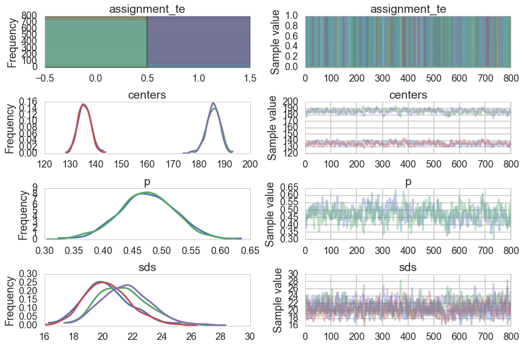


```python
pm.autocorrplot(trace_cm2, varnames=['centers', 'p', 'sds']);
```


There is still quite a bit of autocorrelation and we might want to sample longer. But let us see how we did.


```python
assign_trace = trace_cm2['assignment_te']
```


```python
zpred2=1*(assign_trace.mean(axis=0) > 0.5)
confusion_matrix(zte, zpred2)
```


    array([[211,  23],
           [ 17, 224]])


```python
accuracy_score(zte, zpred2)
```


    0.91578947368421049


The accuracy has improved just by having some additional terms in the likelihood!


```python

cmap = mpl.colors.LinearSegmentedColormap.from_list("BMH", colors)
plt.scatter(xte, 1 - assign_trace.mean(axis=0), cmap=cmap,
        c=assign_trace.mean(axis=0), s=10)
plt.ylim(-0.05, 1.05)
plt.xlim(35, 300)
plt.title("Probability of data point belonging to cluster 0")
plt.ylabel("probability")
plt.xlabel("value of data point")
```


    <matplotlib.text.Text at 0x1247fef28>


